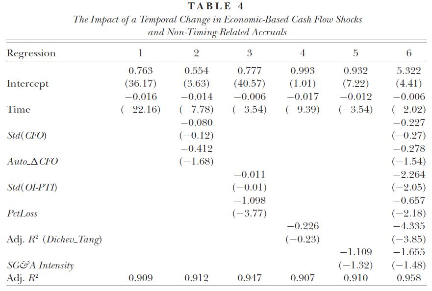

```{r setup, message=FALSE, warning=FALSE, include=FALSE}
knitr::opts_chunk$set(fig.pos = 'p') # Places figures on their own pages
knitr::opts_chunk$set(out.width = '100%', dpi=300)
knitr::opts_chunk$set(echo=FALSE, message=FALSE, warning=FALSE)

source("../code/utils.R")
source("../code/samples.R")
source("../code/tables.R")
source("../code/figures.R")
source("../code/videos.R")

pkgs <- c("devtools", "Quandl", "gtools", "ggpubr", "lfe", "tidyverse", 
          "lubridate", "broom", "tweenr", "moments", "Hmisc", "RCurl", 
          "ggridges", "latex2exp", "knitr", "kableExtra", "ExPanDaR", 
          "nteetor/gganimate@71da746")

invisible(lapply(pkgs, install_pkg_if_missing))
invisible(lapply(pkgs, attach_pkg))

opts_knit$set(root.dir = "..")

# This code relies on the WRDS and some additional data 
# being present in the data/ directory. 
# 
# To make sure that this is the case, run 'produce_findings.R' 
# in the project's root directory prior to knitting this file.
#
# Refer to the Appendix in the paper for additional guidance

needed_data_files <- c("../data/cpiauscl.RDS",
                       "../data/iso3_country_names.RDS",
                       "../data/cstat_us_sample.RDS",
                       "../data/cstat_int_sample.RDS")
if (!all(file.exists(needed_data_files))) 
  stop("Data not downloaded. Please run 'produce_findings.R prior to knitting this file")

refresh <- FALSE
```

``` {r samples, include=FALSE, cache=TRUE}
list2env(prepare_us_samples(), environment())
list2env(prepare_int_samples(), environment())
us_ys <- prepare_us_yearly_sample(test_sample)
int_ys <- prepare_int_yearly_sample(int_20_sample)
int_ys_us <- prepare_int_yearly_sample(all_20_sample)
```

\pagebreak

# Introduction
  
The scientific community widely agrees that reproduction (understood here as reproducing findings using the same sample and method) and replication (understood here as retesting findings using a new sample while applying the same method) of empirical results are a central building block of sound empirical evidence. Yet, published reproduction or replication studies in economics are rare (@DPR).  While several reasons for this observation have been discussed by prior literature, most commentators agree that the lack of established reproducible workflows makes reproductions and replications inherently costly to do (@GGR). 

This study aims to promote reproductions and replications by demonstrating that reproducing the findings of an influential accounting study can provide additional insights into such a fundamental research question as the association between accruals and cash flows. It makes extensive use of exploratory data analysis and visualization tools. Maybe most importantly, it reduces the costs of future reproductions and extensions of archival studies in two ways: For one, it uses an open science workflow that allows researchers to immediately use and build on the underlying code and data. For another, it features the ExPanDar toolbox, developed especially for this study. This open source R package allows interactive exploratory panel data analysis in a web-based environment. It thereby provide interested parties (like readers, editors and reviewers) the opportunity to assess the robustness of findings without providing them access to potentially proprietary or commercialized data.

The resulting reduction in reproduction costs should have the following two effects: (a) Using ExPanD, it becomes significantly easier for interested parties to assess the robustness of empirical archival work, reducing the risk of p-hacking and increasing the confidence in published results. (b) Interested researchers can more efficiently reproduce and build on prior evidence, potentially yielding quicker evolution of scientific knowledge.

To demonstrate the usefulness of this workflow, I reproduce and extend a study addressing a key area of interest to empirical archival researchers in the area of financial accounting: the statistical properties of cash flow accrual association. The central objective of accruals is to smooth temporary fluctuations in cash flows, thereby increasing the informativeness of earnings. This accounting activity results in a negative association between accruals and concurrent cash flows from operations. @BLZ (BLZ from now on) analyze the time trend of this association for U.S. firms and provide compelling evidence that the negative association between accruals and cash flow from operations diminishes over time. They also document that this trend cannot easily be explained by economics-based cash flow shocks, changes in the sample composition, changes in the asymmetric timeliness of earnings or by industry trends. Their main explanation for the finding is the increase of non-timing related accrual recognition and the increasing frequency of loss years. 

I revisit and extend the findings of BLZ by applying the following three steps: 

(i)  *Reproduction* (same research design, same population, same sample): 
I reproduce the sample and key variables of BLZ as well as their main findings. 
(ii) *Robustneess testing* (modified research design, same population):
As BLZ discuss that their main tests based on a sample of 51 yearly observations are affected by multicollinearity, I document how this multicollinearity affects the reliability of their the main inferences. I show that, based on the reproduced sample, one cannot make any reliable inference about which factors explain the declining cash flow accrual association, thereby qualifying some of BLZ's key findings. By using state of the art tools for data visualization I provide additional exploratory insights into the driving forces behind the diminishing cash flow accrual association in the U.S.. To enable the interested reader to explore the robustness of the BLZ findings him/herself, I provide interactive online access to the reproduced sample via the ExPanD tool. 
(iv) *Replication and extension* (same and modified research design, different population, different sample):
In order to address the multicollinearity issue that affects the U.S. analysis of BLZ, I replicate their methodology for an international sample, thereby moving from 51 yearly observations to up to a maximum of 788 country-year observations. Based on this sample, I document that a large part of the time trend in the cash flow accrual association can be explained by changes in the underlying cash flow distribution. The remaining time trend is relatively stable across countries, confined to the nineties, and associated with changes in the number of listed firms and the relative share of intangible intensive industries. Again, I provide readers access to the data underlying my analysis via the ExPanD app.

My findings highlight the benefits of applying an open science work flow for empirical archival studies. I successfully reproduce a current and prominent financial accounting study to show that its main findings are reproducible but subject to careful interpretation because of underlying data issues. My exploration reveals that the distribution of operating cash flows is changing significantly over time and that this appears to be strongly associated with the shift in the cash flow accrual association observed by BLZ. The change in the cash flow distribution and the diminishing cash flow accrual association is also observable for the international sample and the associated time-trend is surprisingly robust across countries. The time trend is associated with the IPO wave in the nineties, leading to an inflow of firms from intangible intensive industries, in particular the health sector. 

The results from BLZ are commonly interpreted to indicate that changes in accounting rules have triggered an increase in non-timing related accruals, ultimately driving the weakening cash flow accrual association. My evidence is largely at odds with this explanation. Instead, it seems consistent with changing firm demographics, meaning more young intangible intensive firms becoming publicly listed around the globe, being influential for the observed changes in the cash flow accrual association. 

A concurrent working paper which also builds on the findings of BLZ is @NSV. The authors investigate the role of earnings and cash flow from operations for the predictability of future cash flows. Interestingly, they find that the explanatory power of operating cash flows (to predict future operating cash flows) increases over time. They show that this observation generalizes to an international sample of firms. Using a similar methodology as BLZ, they observe that the explanatory power of operating cash flows is associated with "decreasing operating cycles, decreasing working capital and increasing intangible intensity". While @NSV explore the effect of BLZ's findings on the predictive power of operating cash flows and accruals, my focus is on understanding the drivers of the diminishing association between accruals and cash flows better. The changes in the temporal distribution of cash flows documented in this study might also be influential for the findings of @NSV. However, I am not exploring this link here.

The code used to generate this paper and its results is publicly available on GitHub. The code has been optimized for reproducibility. The open science workflow enables researchers to build on my findings and to continue exploring the landscape of accrual accounting. Readers who have access to national and international Compustat data via the WRDS interface should be able to reproduce all of my findings easily by following the Reproduction Guide provided in the Appendix.

In addition, the interactive panel data exploration toolbox ExPanD developed as part of this project has the potential to reduce the need for reproduction of prior work: It facilitates systematic data exploration and robustness checking in a web-based environment. The code for ExPanD has been developed with the objectives of accessibility and re-usability in mind and is available as a separate R package (["ExPanDaR"](https://github.com/joachim-gassen/ExPanDaR)). It can be used with generic panel data sets online ([click here](https://jgassen.shinyapps.io/expand)) and easily adapted to host specific panel data for secure online user-side exploration. It enables researchers to assess the robustness of published work without having access to the underlying data. I hope that it will reduce p-hacking, improve the efficiency of the review process and speed up the generation of new exploratory insights. 

# Reproduction of @BLZ

I choose with BLZ a study for my reproduction and replication exercise that (i) provides an important finding, which is broad in its scope and has the potential to substantially influences future financial accounting research, (ii) is exploratory in nature and raises related research questions that i am able to address by further data exploration within-sample or out-of-sample and (iii) which facilitates reproduction (e.g., publicly available data, thorough documentation of data collection, sample selection and research design). 

BLZ document that the negative association between accruals and concurrent cash flows in the U.S. decreased substantially over time and virtually disappeared in recent years. This finding is very relevant for our field as the properties of accruals are key drivers of established measures for earnings quality and earnings management (e.g., @J, @D, @DD, @DGS for an overview). As BLZ indicate in their study, work that is using such measures might be picking up overall time trends when designing tests (partially) relying on the time dimension for identification such as difference-in-differences designs. Given that the common trend assumption is critical for these designs, a key research question of @BLZ (and also of this study) is the identification of cross-sectional variation that helps to explain this striking time-series pattern.

Another reason why the findings of BLZ are a good candidate for exploration and extensions is the magnitude of the additional tests and extensions that the authors themselves provide. To some extent, BLZ can itself be classified as exploratory. By using visual exploratory data analysis tools, I try to make the findings of BLZ more accessible to the reader, potentially allowing future work to chart the accrual landscape at an even higher level of detail.

I start reproducing the sample of BLZ by following the sample selection steps and the variable definitions of BLZ as closely as possible. First, I create a `r format(file.info("data/cstat_us_sample.RDS")$mtime, "%B %d, %Y")` dump of the Compustat US North America fundamentals data base. Second, I generate the variables used in BLZ by following their definitions (The resulting variable definitions are presented in the Appendix). I translate values in Canadian Dollars to U.S. Dollars. Third, I apply the sample screens and the by-year winsorizing procedure described in BLZ, p.49f. This means that I delete observations from the financial services industry, observations from years with significant mergers/acquisitions activity and observations with missing cash flow or accrual data. In addition, I limit the sample to the periods 1964 to 2014. I refer the resulting sample as the reproduced sample. Its descriptive statistics are displayed in Table \ref{tab:descriptives_rs}.

```{r descriptives_rs, cache = TRUE, echo = FALSE, results="asis"}
t <- prepare_descriptive_table(rep_sample[, c("e", "tacc", "lagcfo", 
                                             "cfo", "leadcfo", "mv", 
                                             "bm", "sgaint")])
desc_rnames <- c("$E_{i,t}$", "$TACC_{i,t}$", "$CFO_{i,t-1}$", "$CFO_{i,t}$", "$CFO_{i,t+1}$", 
                    "$MV_{i,t}$", "$BM_{i,t}$", "$SGAINT_{i,t}$")
rownames(t$df) <- desc_rnames
names(t$df)[c(5,7)] <- c("25 \\%", "75 \\%")
kable(t$df, digits = c(0, 3, 3, 3, 3, 3, 3, 3), format = "latex",
      caption = "\\label{tab:descriptives_rs}Descriptive Statistics Reproduced Sample",
      format.args = list(decimal.mark = ".", big.mark = ",", 
                         scientific=FALSE),
      booktabs = TRUE, escape = FALSE, linesep = "") -> kab_latex

lat_tab <- unlist(strsplit(kab_latex, "\n"))
lat_tab[6] <- "\\\\[-1.8ex]\\hline \\hline \\\\[-1.8ex]"
lat_tab[8] <- "\\hline\\\\[-1.8ex]"
lat_tab[length(lat_tab) - 2] <- "\\\\[-1.8ex]\\hline \\hline \\\\[-1.8ex]"

latex_tab <- c("\\begin{table}[!htbp]",  
               lat_tab[3],
               "\\begin{threeparttable}",
               lat_tab[5:(length(lat_tab) - 1)],
               "\\begin{tablenotes}[flushleft]",
               "\\setlength{\\labelsep}{0pt}",
               "\\footnotetext",
               "\\item Note: This reproduced sample contains annual Compustat North America data for the period 1964 to 2014. The sample selection process follows the procedure described in BLZ, p.49f: I delete observations from the financial services industry, observations from years with significant mergers/acquisitions activity and observations with missing cash flow or accrual data. Also in line with BLZ, I by-year winsorize all data besides $MV_{i,t}$ to the top and bottom percentile. Variables are as defined in Table \\ref{tab:vardef}.",
               "\\end{tablenotes}",
               "\\end{threeparttable}",
               "\\end{table}")
cat(paste(latex_tab, collapse = "\n"))  
```

For reference, Figure \ref{fig:blz_descriptives} displays the descriptive statics of the original BLZ sample as presented in Panel A of BLZ's Table 1. I note several differences between the sample of BLZ and my sample. First, my sample is larger then the sample of BLZ (`r format(length(rep_sample$cfo), big.mark = ",") ` versus 217,164 observations of BLZ). Second, firms in my sample seem to be significantly smaller than the firms of BLZ (mean market value in reproduced sample M US-\$ `r format(mean(rep_sample$mv, na.rm=TRUE), big.mark = ",", digits = 3)` versus 2,139 of BLZ).

```{r blz_descriptives, echo = FALSE, out.height = "6cm", fig.align="center", fig.cap="\\label{fig:blz_descriptives}Table 1, Panel A of BLZ"}
include_graphics("../media/blz_table_1_panel_a.jpg")
```

I assume that my initial Compustat data screens differ from the screens that BLZ applied, as my sample appears to include additional firms that tend to be relative small in terms of market value. In order to make my sample more comparable to the one used in BLZ, I apply an additional screen and exclude firms with average total assets below M US-\$ 7.5 from my sample (prior to winsorizing the data). I label the resulting sample as the test sample. Table \ref{tab:descriptives_ts} reports its descriptive statistics.

```{r descriptives_ts, cache = TRUE, echo = FALSE, results="asis"}

t <- prepare_descriptive_table(test_sample[, c("e", "tacc", "lagcfo", 
                                               "cfo", "leadcfo", "mv", 
                                               "bm", "sgaint")])
rownames(t$df) <- desc_rnames
names(t$df)[c(5,7)] <- c("25 \\%", "75 \\%")

kable(t$df, digits = c(0, 3, 3, 3, 3, 3, 3, 3), format = "latex",
      caption = "\\label{tab:descriptives_ts}Descriptive Statistics Test Sample",
      format.args = list(decimal.mark = ".", big.mark = ",", 
                         scientific=FALSE),
      booktabs = TRUE, linesep = "", escape = FALSE) -> kab_latex

lat_tab <- unlist(strsplit(kab_latex, "\n"))
lat_tab[6] <- "\\\\[-1.8ex]\\hline \\hline \\\\[-1.8ex]"
lat_tab[8] <- "\\hline\\\\[-1.8ex]"
lat_tab[length(lat_tab) - 2] <- "\\\\[-1.8ex]\\hline \\hline \\\\[-1.8ex]"

latex_tab <- c("\\begin{table}[!htbp]",  
               lat_tab[3],
               "\\begin{threeparttable}",
               lat_tab[5:(length(lat_tab) - 1)],
               "\\begin{tablenotes}[flushleft]",
               "\\setlength{\\labelsep}{0pt}",
               "\\footnotetext",
               "\\item Note: The test sample is based on the reproduced sample reported in Table \\ref{tab:descriptives_rs}. In addition to the sampling process described there, observations with $AVGAT$ below M US-\\$ 7.5 are excluded. Variables are as defined in Table \\ref{tab:vardef}.",
               "\\end{tablenotes}",
               "\\end{threeparttable}",
               "\\end{table}")
cat(paste(latex_tab, collapse = "\n"))  

```

After applying this additional screen, the test sample appears to be reasonably close, both in terms of sample size and descriptive statistics, to the BLZ sample presented in Figure \ref{fig:blz_descriptives}. The only noteworthy exemption is that the extreme values of TACC presented by BLZ (Minimum -1.717 and Maximum 1.249) are substantially larger compared to the extreme values presented in our test sample (Minimum `r format(min(test_sample$tacc), digits = 3)` and Maximum `r format(max(test_sample$tacc), digits = 3)`).

Despite these remaining differences, I continue by reproducing the main finding of BLZ. Therefore, I estimate yearly regressions of the following model:

\begin{equation}
\label{level_reg}
TACC_{t,i} = \beta_{0,t} + \beta_{1,t} CFO_{t,i} + \epsilon_{t,i}
\end{equation}

```{r level_results, cache = TRUE, echo = FALSE, fig.cap="\\label{fig:level_results}Regression results for yearly estimates of model (\\ref{level_reg}) compared to results of BLZ, Table 2"}
prepare_fig_rep_blz_results(us_ys, "level", "cfo")
```

The left hand side of Figure \ref{fig:level_results} presents the $\beta_1$ coefficient over time along with the original coefficients reported in Table 2 of BLZ. It shows that my results are very similar to the key result reported in Table 2 of BLZ. In both cases, we observe a steady increase in $\beta_1$ over time indicating that the cash flow/accrual association weakens over time. Furthermore, my results in terms of the adjusted $R^2$ (right-hand side of Figure \ref{fig:level_results}) mirror the findings of BLZ and illustrate the pronounced decline in the correlation between accruals and cash flows over time. The successful reproduction of the key BLZ findings provides me with confidence that our test sample is close enough to the original sample of BLZ.


```{r blz_tab4, echo = FALSE, out.height = "15cm", fig.align="center", fig.cap="\\label{fig:blz_descriptives}Table 4 of BLZ"}

```

As a next step, I reproduce Table 4 of BLZ (presented as Figure \ref{fig:blz_tab4}) that contains its key findings. For this Table, BLZ calculate a yearly time series of adjusted $R^2$ values from by year @DD type regressions:

\begin{equation}
\label{dd_reg}
TACC_{t,i} = \gamma_{0,t} + \gamma_{1,t} CFO_{t-1,i} + \gamma_{2,t} CFO_{t,i} + \gamma_{3,t} CFO_{t+1,i} + \epsilon_{t,i}
\end{equation}

They then regress this time-series of 51 observations on a set of covariates. First, they use the yearly standard deviation of cash flows ($CFO\_SD$) and the one-period autocorrelation of cash-flows ($DCFO\_ACORR$) as indicators for economic and timing related cash-flow shocks. Second, they use the standard deviation of one time and non-operating items ($SD\_OI\_PTI$) to assess the effect of non-timing related accruals. Third, they include the yearly frequency of loss firms ($PCTLOSS$) that they also interpret as a proxy for non-timing related accruals. Forth, they use the adjusted $R^2$ of @DT regressions ($DT\_ADJRSQ$):

\begin{equation}
\label{dt_reg}
SALES_{t,i} = \delta_{0,t} + \delta_{1,t} EXPENSES_{t-1,i} + \delta_{2,t} EXPENSES_{t,i} + \delta_{3,t} EXPENSES_{t+1,i} + \epsilon_{t,i}
\end{equation}


as a measure for the matching between revenues and expenses. Forth and finally, they use the annual average of the selling, general and administrative expenses ($SGAINT$) as an indicator of intangible intensity.

I follow the variable definitions and the regression setup of BLZ (variable definitions are included in the Appendix). The resulting regression results are reported in Table \ref{tab:tab_blz_tab4}. 

``` {r tab_blz_tab4, cache = TRUE, results="asis"}
tab_blz_tab4 <- prepare_tab_blz_tab4(us_ys)
tab_blz_tab4$table[12] <- "\\\\[-1.8ex] & $Adj. R^2$ & $Adj. R^2$ & $Adj. R^2$ & $Adj. R^2$ & $Adj. R^2$ & $Adj. R^2$ \\\\ "

latex_tab <- c("\\begin{table}[!htbp]",
               "\\caption{\\label{tab:tab_blz_tab4}Replication of Table 4 of BLZ}",
               "\\centering",
               "\\small",
               "\\begin{threeparttable}",
               "\\setlength{\\tabcolsep}{2pt}",
               "\\begin{tabular}{lcccccccc}",
               tab_blz_tab4$table[8:14],
               toupper(sub(pattern = "(\\b[a-zA-Z][a-zA-Z0-9\\\\_]+\\b)", "$\\1$", tab_blz_tab4$table[15:39])),
               tab_blz_tab4$table[40:(length(tab_blz_tab4$table) - 3)],
               "\\end{tabular}",
               "\\begin{tablenotes}[flushleft]",
               "\\setlength{\\labelsep}{0pt}",
               "\\footnotetext",
               "\\item Note: This table reporoduces Table 4 from BLZ. Dependent variabe is the adjusted $R^2$ metric from model (\\ref{dd_reg}). All independent variables are as defined in the Appendix. Variance inflation factors are reported in square brackets below the standard errors, which are reported in parantheses. $^{*}$/$^{**}$/$^{***}$ indicate two-sided significane levels of 10/5/1 \\%, respectively.",
               "\\end{tablenotes}",
               "\\end{threeparttable}",
               "\\end{table}")

cat(paste(latex_tab, collapse = "\n"))
``` 

Comparing the findings from Table \ref{tab:tab_blz_tab4} with the original BLZ findings presented in Figure \ref{fig:blz_tab4} it is apparent that, while the coefficients for $TIME$ are very similar in terms of magnitude and equally significant, some coefficients exhibit relatively large differences. Most strikingly, the coefficient for $SGAINT$ is robustly negatively associated with the adjusted $R^2$ of @DD regression in my analysis, whereas it is insignificant in the analysis of BLZ. Also, in the full specification presented in the left-most column, the standard deviation of cash flows is significantly positively related with the outcome variable based on my analysis while BLZ find it to be insignificant. Finally, in the full specification, $PCTLOSS$ is insignificant in my specification bus significantly negative in BLZ's analysis.

It is non-trivial to explain these differences, also as BLZ do not report descriptive statistics for their independent variables. Omitting yearly winsorizing of the independent variables (Table 1 of BLZ indicates that all variables besides market value are winsorized but the footnote to Table 4 refers only to accrual and cash flow data as been winsorized) brings the results closer to the original findings of BLZ but not surprisingly these differences are driven by very few extreme observations. In addition, BLZ base their Table 4 to the periods 1964-2013 (50 observations). Omitting 2014 has only a very limited impact on the results presented in Table \ref{tab:tab_blz_tab4}. The online representation of this paper ([click here to ExPanD](https://jgassen.shinyapps.io/expacc)) presents an alternative sample (BLZ reproduced) that is based on an attempt to reproduce the methodology of BLZ as closely as possible.

# Robustness

The reproduction already indicates that the findings of Table \ref{tab:tab_blz_tab4} are very sensitive to design choices. A main reason for this are the high to extremely high variance inflation factors that are presented in squared brackets in Table \ref{tab:tab_blz_tab4}. BLZ openly discuss that multicollinearity is an issue in their study:

\begin{displayquote}

"One caveat in identifying potential explanations for the attenuation in
the correlation between accruals and cash flows is that the explanatory variables
considered in table 4 are highly correlated. The magnitude of Pearson
correlations between the six explanatory variables ranges from 0.5 to 0.9,
while the time-series examined provide only 51 observations for each variable.
Multicollinearity could increase the standard error and thus render
the coefficient estimate on one or more variables to be statistically insignificant.
The second caveat is that any variable that is mechanically related
to the time trend, such as the authors’ age over time, is likely to exhibit
significant coefficients. In light of these two caveats, we adopt the following
criteria when interpreting the results. First, each explanatory variable
should have a strong economic theory or intuition. Second, the explanatory
variable should have a significant coefficient with the expected sign in
the stand-alone regression, and the coefficient must not flip its sign from
the stand-alone regression to the full model presented in column 6. Under
these criteria, we interpret the results in table 4 to mean that one-time
and nonoperating items and loss firms are mostly responsible for the attenuation
in the overall correlation between accruals and cash flows and explain
the majority of the effect (about 63 \% = (0.016-0.006)/0.016)." (BLZ, p. 65-66)

\end{displayquote}

To explore the multicollinearity issue in more detail, Table \ref{tab:tab_blz_univariate} reports univariate regression results based on the variables used in Table \ref{tab:tab_blz_tab4} and Table \ref{tab:correlations_ys_us} the Pearson and Spearman correlations for the time series sample. 

``` {r tab_blz_univariate, cache = TRUE, results="asis"}
tab_blz_univariate <- prepare_tab_blz_univariate(us_ys)
tab_blz_univariate$table[12] <- "\\\\[-1.8ex] & $Adj. R^2$ & $Adj. R^2$ & $Adj. R^2$ & $Adj. R^2$ & $Adj. R^2$ & $Adj. R^2$ & $Adj. R^2$ & $Adj. R^2$\\\\ "

latex_tab <- c("\\begin{table}[!htbp]",
               "\\caption{\\label{tab:tab_blz_univariate}Univaiate Associations of BLZ Variables}",
               "\\centering",
               "\\small",
               "\\begin{threeparttable}",
               "\\setlength{\\tabcolsep}{2pt}",
               "\\begin{tabular}{lcccccccc}",
               tab_blz_univariate$table[8:14],
               toupper(sub(pattern = "(\\b[a-zA-Z][a-zA-Z0-9\\\\_]+\\b)", "$\\1$", tab_blz_univariate$table[15:39])),
               tab_blz_univariate$table[40:(length(tab_blz_univariate$table) - 3)],
               "\\end{tabular}",
               "\\begin{tablenotes}[flushleft]",
               "\\setlength{\\labelsep}{0pt}",
               "\\footnotetext",
               "\\item Note: This table reports univariate associations for the variables used in Table 4 of BLZ. Dependent variabe is the adjusted $R^2$ metric from model (\\ref{dd_reg}). All independent variables are as defined in the Appendix. Variance inflation factors are reported in square brackets below the standard errors, which are reported in parantheses. $^{*}$/$^{**}$/$^{***}$ indicate two-sided significane levels of 10/5/1 \\%, respectively.",
               "\\end{tablenotes}",
               "\\end{threeparttable}",
               "\\end{table}")

cat(paste(latex_tab, collapse = "\n"))
``` 

``` {r correlations_ys_us, cache = TRUE, results="asis"}
tab <- prepare_correlation_table(us_ys[,c("dd_adjr2","time", "cfo_sd", "dcfo_acorr", 
                                          "std_oi_pti", "pctloss", "dt_adjr2", "sgaint")], 
                                 format = "latex", booktabs = TRUE, linesep = "")
tab$kable_ret <- gsub("%", "\\%", tab$kable_ret)
tab$kable_ret <- gsub("_", "\\\\_", tab$kable_ret)
lat_tab <- unlist(strsplit(tab$kable_ret, "\n"))
lat_tab[7:14] <- sub("(\\b[a-zA-Z2\\\\_]{2,}\\b)", "\\U$\\1$", lat_tab[7:17], perl = TRUE)
lat_tab[7] <- sub("\\$.*\\$", "$Adj. R^2$", lat_tab[7])
lat_tab[4] <- "\\\\[-1.8ex]\\hline \\hline \\\\[-1.8ex]"
lat_tab[6] <- "\\hline\\\\[-1.8ex]"
lat_tab[15] <- "\\\\[-1.8ex]\\hline \\hline \\\\[-1.8ex]"
latex_tab <- c("\\begin{table}[!htbp]",  
               "\\caption{\\label{tab:correlations_ys_us}Correlations for U.S. Time-Series Sample}",
               "\\centering",
               "\\small",
               "\\begin{threeparttable}",
               "\\setlength{\\tabcolsep}{5pt}",
               lat_tab[3:16],
               "\\begin{tablenotes}[flushleft]",
               "\\setlength{\\labelsep}{0pt}",
               "\\footnotetext",
               lat_tab[18:20],
               "\\end{table}")
latex_tab[24] <- paste(latex_tab[24], "All variables are as defined in the Appendix.")
cat(paste(latex_tab, collapse = "\n"))               
```

Based on the reproduced sample, the multicollinearity of the independent variables seems even more severe than based on the analysis of BLZ. The absolutely smallest Pearson (Spearman) correlation is `r format(min(abs(tab$df_cor[upper.tri(tab$df_cor)])), digits = 2)` (`r format(min(abs(tab$df_cor[lower.tri(tab$df_cor)])), digits = 2)`) and most of the correlations are larger than 0.9. The univariate results in Table \ref{tab:tab_blz_univariate} support the observation of BLZ. Only $STD\_OI\_PTI$, $PCTLOSS$ and $SGAINT$ pass the "smell test" suggested by BLZ in the sense that they are significant in the expected suggestion direction univariately and at least have the same sign in the multiple regression of Table \ref{tab:tab_blz_tab4}. However, the magnitude of the $STD\_OI\_PTI$ and $PCTLOSS$ coefficients changes drastically across specifications. The $SGAINT$ coefficient, which proxies for intangible intensity, stays relatively constant but differs from the BLZ analysis.^[While I can only speculate as of why, using the ExPanD platform and the BLZ reproduced sample it becomes apparent that its time-series of $SGAINT$ observations is drastically influenced by two outliers if it is calculated based on non-winsorized data.]

Based on the above, the last column of Table \ref{tab:tab_blz_univariate} presents the results of a multiple regression that contains only the independent variables that pass the BLZ "smell test". I make two observations. First, the variance inflation factors are all close to or clearly above 10 in this regression, indicating strong multicollinearity. Second, the coefficient for $STD\_OI\_PTI$ flips its sign and becomes insignificant. Based on standard econometrics, multicollinearity implies that estimates for each individual coefficient are imprecise as observations for this variable are not orthogonal to the other covariates. Thus, the only valid conclusion that I can draw so far from reproducing the analysis of BLZ is that $TIME$, $STD\_OI\_PTI$, $PCTLOSS$ and $SGAINT$ are jointly associated with the reduction of $R^2$ of @DD regression in the U.S. over time.^[On a more conceptual note, the constructs $STD\_OI\_PTI$ and $PCTLOSS$ could also be challenged as they are driven by accruals and as such are mechanically related to the dependent variable. Also, the support for $TIME$ is not existent ex ante but is to be supported by the empirical analysis. In the notion of the argument quoted from @BLZ above, this would require a higher reliability hurdle for the $TIME$ coefficient. I am not following these arguments here as I concentrate on the general feasibility of the research design.] Any conclusions beyond that, and in particular that at the end of the quote above, are not supported by my reproduction.

Therefore and to contribute to our understanding about the potential reasons for the diminishing cash flow accrual association, I now revisit the changes in the cash flow accrual association documented by BLZ more fundamentally. I do this by first exploring the association with visual tools. After that, I use an international sample that allows me to identify covariates that are associated with this phenomenon.

# Exploration

From the results of the previous section, I take special interest in the flipping coefficient for $CFO\_SD$. Based on the definition of $R^2$, one should expect a mechanical positive association between the variance of the dependent variable of the @DD regression ($CFO$) and $R^2$, assuming that the variance of the residual stays constant. For the multiple regression, we observe this positive association but univariately, the association is strongly negative. This can only be the case if the functional form of the cash flow accrual association varies along the cash flow distribution overt time and indicates that the distribution of $CFO$ is related to the cash flow accrual association.

To explore this further, I partition the test sample by cash flow deciles. For each decile, I re-run simple yearly regressions based on model \ref{level_reg}. In the second step, I use the generated $\beta_1$ and adjusted $R^2s$ and regress them on the variable $TIME$: 

\begin{equation}
\label{time_reg}
\beta_{1,t} [Adj. R^2_t]= b_0 +b_1 TIME_t +\epsilon_t
\end{equation}

Figure \ref{fig:level_by_cfo} plots the $b_1$ estimates of model (\ref{time_reg}) across the cash flow deciles. It shows that the time trend (of the diminishing cash flow accrual association) is strongly moderated by the magnitude of operating cash flows. Negative cash flow firms experience the diminishing cash flow accrual association but the trend is much less pronounced for positive cash flow firms. 

``` {r fig_level_by_cfo, cache = TRUE, fig.cap="\\label{fig:level_by_cfo}$TIME$ coefficient of model (\\ref{time_reg}) by $CFO$ deciles"}
prepare_fig_level_by_cfo(test_sample, "cfo_est")
```

I next explore whether this observation extends to the time trend with respect to the adjusted $R^2$ of model (\ref{level_reg}). Figure \ref{fig:level_by_cfo_r2} communicates the result.

``` {r level_by_cfo_r2, cache = TRUE, fig.cap="\\label{fig:level_by_cfo_r2}$TIME$ coefficient of model (\\ref{time_reg}) with $Adj. R^2$ as dependent variable by cash flow deciles"}
prepare_fig_level_by_cfo(test_sample, "adjr2")
```

This pattern is striking as it indicates that the drop in $Adj. R^2$ described in BLZ seems to be driven by extreme cash flow observations. To explore this fact a little bit further, Figure \ref{fig:level_by_cfo_comp} plots the time trends separately for firms within the first, fifth and tenth decile of $CFO$. It becomes apparent from the plot that the explanatory power of cash flows for accruals tends to lie in the extremes. Given that the bins at the extreme deciles are wider, this is not entirely surprising. What seems more relevant is that the coefficient trend differs clearly across the extremes. For the sub-sample with particularly low cash flows the negative association between accruals and cash flows clearly diminishes at the end of the sample period. In contrast, for firms with particularly high cash flows, the association seems to be more persistent (positive $R^2$s and negative coefficient throughout the sample period). 

``` {r level_by_cfo_comp, cache = TRUE, fig.cap="\\label{fig:level_by_cfo_comp}$CFO$ coefficients and $Adj. R^2$ of model (\\ref{level_reg}) by cash flow deciles"}
prepare_fig_level_comp(test_sample, "cfo")
```

While one observes a negative association between cash flows and accruals for all sub-samples at the beginning of the sample period, the association becomes positive for the low cash flow sub-sample and remains negative for the high cash flow sub-sample. This indicates a change in the functional form of the association between cash flows and accruals. 

To explore the functional form of the cash flow accrual association over time, I estimate locally estimated smooth regressions for yearly samples. The result can be visualized by a video ([click here to see video](https://www.wiwi.hu-berlin.de/rewe/research/test_samplecfo_tacc_scatter.mp4)) or by comparing the functional forms across two samples, one spanning the beginning of the sample period (1964-1973) and one spanning the end of the sample period (2005-2014).

``` {r scatter_sbs, cache = TRUE, dev = "png", fig.height = 6, fig.cap="\\label{fig:scatter_sbs} $CFO$ and $TACC$ scatter plots (sample of 20,000 observations for each period)"}
prepare_fig_scatter_sbs(test_sample)
```

Figure \ref{fig:scatter_sbs} and the video display a stark contrast in the estimated functional form. For the beginning of the sample period the relation is almost perfectly linear. However, towards the end of the sample period the relation is highly non-linear, exhibiting a kinked regression curve very much in line with the idea of asymmetric timeliness of accruals as suggested by @BS. Note that the strong difference in the functional forms across periods is not driven by an increasing sample size, as the plot is based on 20,000 observations for each period. 

The change in the functional form seems to be mainly driven by two types of firm-year observations that were not observable in the early sample periods: (i) observations with extremely low operating cash flows (ii) firm-year observations with moderate levels of operating cash flows but particularly low accruals. This results in a positive (negative cash flow accrual association for firm-year observations with negative (positive) cash flows towards the end of the sample period. Again, this finding is in line with Figure \ref{fig:level_by_cfo_comp}, which indicated that the cash flow accrual association is strongly moderated by the magnitude of operating cash flows. 

What also becomes apparent is that the distribution of cash flows and accruals becomes more dispersed towards the end of the sample period. To visualize the change in the distribution of operating cash flows over time, we plot density estimates over the sample years in Figure \ref{fig:cfo_density_ridge}.

``` {r cfo_density_ridge, cache = TRUE, fig.cap="\\label{fig:cfo_density_ridge}Density of $CFO$ over time"}
prepare_fig_cfo_density_ridge(test_sample)
```

Towards the end of the sample period the distribution of cash flow from operations becomes significantly wider and more left skewed. Particularly, the increase of relatively large negative cash flows over time is striking and likely to be influential for the observed change in functional form. As becomes apparent from the video and as has been documented by prior literature (@S, @FF), many of these negative cash flow firms entered the U.S. market during the 80s and the 90s. Therefore, I explore next how the changes in the cash flow accrual association relate to sample composition over time. 

``` {r rolling_bs, cache = TRUE, fig.cap="\\label{fig:rolling_bs}Development of adjusted $R^2$ over time for balanced samples"}
prepare_fig_rolling_sample(test_sample, 20, "dd", "adjr2")
```

Figure \ref{fig:rolling_bs} presents a visual reporting the $TIME$ coefficient from model (\ref{time_reg}) based on adjusted $R^2$s from @DD regressions based on balanced samples ending in the respective period. It documents that the time trend was strongest for the period 1973 to 1992 and are last observed to be significant for the time period 1984 to 2003.^[One potential concern about this analysis is that $R^2$ is bounded by zero and that, as the association between cash flow and accruals weakens, $R^2$s converge to zero. I address this concern by also analyzing fisher-transformed values of $R^2$ that are not bound by zero. The graph looks almost identical with different magnitudes of coefficients and I present the untransformed version here for expositional ease.] This implies, first, that the trend is driven by 80s and the 90s in the U.S. and second, in line with the analysis presented by @BLZ, that it not (only) due to new firms entering the market.

Finally, visual inspection of Figure \ref{fig:scatter_sbs} also indicates that a sizable fraction of these loss firms are based in the health sector. As can be easily confirmed by studying a random sample of the annual reports of these large negative cash flow firms, most of those tend to be relatively small, and invest heavily in in-process research and development. As these expenses do not materialize as tangible capitalizable assets, they result in negative cash flows that are large relative to the firms' asset base. Since many of firms seek new financing regularly, it is not uncommon for them to report persistently large negative cash flows over multiple years.

``` {r corr_change_by_ind, cache = TRUE, fig.height = 6, fig.cap="\\label{fig:corr_change_by_ind}Industry and sample composition effects combined"}
prepare_fig_corr_change_by_ind(test_sample)
```

Figure \ref{fig:corr_change_by_ind} explores this observation more formally and also tests whether new IPO firms contribute to the change in the cash flow accrual association. It reports the standard deviation of $CFO$ and the Pearson correlation between $CFO$ and $TACC$ for different industry samples over time. In combination, these measures help to understand the drivers of the $R^2$ metric of model (\ref{level_reg}):

\begin{equation}
\label{r2_comp}
R^2 = \rho(CFO, TACC)^2 = \frac{cov(CFO,TACC)^2}{\sigma^2(CFO)\sigma^2(TACC)}
\end{equation}

The left panel of Figure \ref{fig:corr_change_by_ind} shows the data for the full test sample, divided by time in two sub-samples up to and post 1989. It becomes apparent that the upward trend in the Pearson correlation measure is present in all industries but particularly strong in the health, business equipment, telecommunication and chemical sectors. All these sectors are regularly classified as being very intangible intensive. The right panel is using a balanced panel containing observations from the ten year period 1985 to 1994. This ten year windows keeps the observational drain from balancing the observations limited but as can be gauged by the dot sizes, it is based on significantly fewer observations than the right panel. Not surprisingly, for the balanced sample, the time trend is much less pronounced. For the extractive industry it is not observable or even runs into the opposite direction. For consumer products it is also very weak. It is strongest for the health sector followed by the chemical sector. This observation is being consistent with new firms contributing to diminishing cash flow accrual association. 

Summing up, the exploratory analysis of the cash flow accrual association reveals the following insights: (1), the distribution of cash flows from observations has changed significantly in the U.S. over the period of 1964 to 2014. It has become more dispersed and more left skewed, leading to a sizable fraction of firms with large negative cash flows, relative to their asset base. (2), this new type of firms has given rise to a new functional form of the cash flow accrual association. It is basically flat and uninformative for negative cash flow firms but remains negative and significant for positive cash flow firms. (3) While this is also consistent with increased level of conditional conservatism as indicated by @BS, it seems that sample composition, in particular new firms entering in the U.S. market in the 80s and the 90s are one reason for this observation (@S). (4) The trend is also observable for incumbent firms. (5) In terms of industries, it seems to be driven by intangible intensive industries, in particular the health sector. In the next section, I will test whether these observations also hold out of sample by using an international sample.  


# International Tests

As documented in the robustness section, it is inherently hard, if not impossible, to infer anything about the covariates that are associated with the diminishing cash flow accrual relation from analyzing U.S. yearly data. In order to address this concern and in order to verify whether my exploratory findings hold out of sample, I now move on to test the association based on international data. Going international allows to use a set of countries as separate observations, moving from a time-series analysis to a panel analysis. To make sure that my exploratory findings base on the U.S. do not bias my inferences, I remove the U.S. from the analysis. 

The data from the  international sample is obtained from Compustat Global. I apply the original BLZ screens, but not the additional size screen, in order to generate the international sample. In addition, I do not drop firm-year observations with significant acquisition activity, given that the Compustat item (# aqs) is not available internationally. As original cash flow data is sparse in the early years of the international data, I replace original cash flow and accruals data with balance sheet based measures whenever original cash flow data are not observable. To be included in the international country-year sample, I require (i) each country-year to have at least 30 firm-year observations and after applying this filter (ii) each country to have at least 20 country-years. For country-years with at least (less) than 100 firm-years I winsorize the extreme 1% (5%) observations on either side for each of all continuous variables. The resulting sample period spans from `r format(min(int_20_sample$year))` to `r format(max(int_20_sample$year))`. 

```{r world_sample, cache = TRUE, results = "asis"}
df <- int_20_sample_obs
names(df) <- c("ISO code", "Country", "# years", "# observations")
kable(df, format = "latex", booktabs = T, linesep = "",
      format.args = list(decimal.mark = ".", big.mark = ",", 
                         scientific=FALSE)) -> kab_latex

lat_tab <- unlist(strsplit(kab_latex, "\n"))
lat_tab[3] <- "\\\\[-1.8ex]\\hline \\hline \\\\[-1.8ex]"
lat_tab[5] <- "\\hline\\\\[-1.8ex]"

latex_tab <- c("\\begin{table}[!htbp]",  
               "\\caption{\\label{tab:world_sample}International Panel Sample}",
               "\\centering",
               "\\small",
               "\\begin{threeparttable}",
               "\\setlength{\\tabcolsep}{4pt}",
               lat_tab[2:37],
               "\\hline\\\\[-1.8ex]",
               paste0("Total & & ", 
                      format(nrow(int_ys), big.mark = ","), 
                      " & ", 
                      format(nrow(int_20_sample), big.mark = ","), 
                      "\\\\"),
               "\\\\[-1.8ex]\\hline \\hline \\\\[-1.8ex]",
               "\\end{tabular}", 
               "\\begin{tablenotes}[flushleft]",
               "\\setlength{\\labelsep}{0pt}",
               "\\footnotetext",
               "\\item Note: Country year sample for international analyes. All non-U.S. countries with at least 20 years of data are included. A minimum of 30 firm-year observations is required to estimate the sample statistics for each country year to be included in this sample.",
               "\\end{tablenotes}",
               "\\end{threeparttable}",
               "\\end{table}")
cat(paste(latex_tab, collapse = "\n"))               
```

Table \ref{tab:world_sample} shows the distribution of the test sample across countries. In a first step, I examine the extent to which the diminishing cash flow accrual association represents an international phenomenon. For this reason, I estimate model (\ref{time_reg}) for each country and plot the respective time coefficient in Figure \ref{fig:time_effect_by_country}. For the sake of comparison, this figure also contains a $TIME$ estimate for the U.S., based on data spanning the same sample period `r format(min(int_20_sample$year))` to `r format(max(int_20_sample$year))`. A higher (lower) coefficient in Figure \ref{fig:time_effect_by_country} indicates a more pronounced decline of the association between cash flows and accrual over time. The figures illustrate that the diminishing cash flow and accrual association is indeed an international phenomenon. In the majority of countries the time-trend is even more pronounced than in the US. However, it has to be noted that, as can be assessed by Figure \ref{fig:level_results}, the trend in the U.S. is most prominent in the period prior to 1989. 

``` {r time_effect_by_country, cache = TRUE, fig.cap="\\label{fig:time_effect_cfo_world_sbs}$TIME$ coefficient by country for the adjusted $R^2$s of Dechow and Dichev regressions"}
time_effects <- estimate_int_time_effect(int_ys_us)
prepare_fig_time_effect_by_country(time_effects, "dd_adjr2")
```

In order to estimate to which extent intangible intensity, non-timing related accruals and market composition explain the diminishing cash flow accrual association, I use two additional variables besides the metrics $SGAINT$, $STD\_OI\_PTI$, $PCTLOSS$ from the BLZ analysis. First, I assess the frequency of IPOs and delistings by measuring the relative number of listed firms in a given country year, relative to the maximum of listed firms for each country ($REL\_MSIZE$). Second, I measure the share of firms from intangible intensive industries in each country year ($SHARE\_INT\_IND$). Based on my exploratory findings from the last section, I classify the sectors health, business equipment, telecommunication and chemical as intangible intensive sectors. In addition to these variables, I also include the first three moments of the cash flow distribution ($CFO\_MEAN$, $CFO\_SD$ and $CFO\_SKEW$) to control for the effect of the changing cash flow distribution over time.

Table \ref{tab:descriptives_ys_int} reports the descriptive statistics for this set of variables and Table \ref{tab:correlations_ys_int} presents the Pearson and Spearman correlations. 

```{r descriptives_ys_int, cache = TRUE, echo = FALSE, results="asis"}
int_ys_vars <- c("dd_adjr2", "cfo_mean", "cfo_sd", "cfo_skew",
                                          "std_oi_pti", "pctloss", "sgaint",
                                          "rel_msize", "share_int_ind")
t <- prepare_descriptive_table(int_ys[, int_ys_vars])
desc_rnames <- paste0("$", sub("_", "\\_", toupper(int_ys_vars), fixed = TRUE), "$") 
desc_rnames[1] <- "$Adj. R^2$"
rownames(t$df) <- desc_rnames
names(t$df)[c(5,7)] <- c("25 \\%", "75 \\%")
kable(t$df, digits = c(0, 3, 3, 3, 3, 3, 3, 3), format = "latex",
      caption = "\\label{tab:descriptives_ys_int}Descriptive Statistics for International Panel Sample",
      format.args = list(decimal.mark = ".", big.mark = ",", 
                         scientific=FALSE),
      booktabs = TRUE, escape = FALSE, linesep = "") -> kab_latex

lat_tab <- unlist(strsplit(kab_latex, "\n"))
lat_tab[6] <- "\\\\[-1.8ex]\\hline \\hline \\\\[-1.8ex]"
lat_tab[8] <- "\\hline\\\\[-1.8ex]"
lat_tab[length(lat_tab) - 2] <- "\\\\[-1.8ex]\\hline \\hline \\\\[-1.8ex]"

latex_tab <- c("\\begin{table}[!htbp]",  
               lat_tab[3],
               "\\begin{threeparttable}",
               lat_tab[5:(length(lat_tab) - 1)],
               "\\begin{tablenotes}[flushleft]",
               "\\setlength{\\labelsep}{0pt}",
               "\\footnotetext",
               sprintf("\\item Note: This international panel sample contains country-yearly observations based on Compustat Global data for the period %d to %d. Observations from the financial services industry and observations without data to calculate cash flow and accrual data are excluded. All firm-year data is by-year winsorized as epxplained in the paper tbefore calcuating the country-year measures. To be included in this panel, a country-year neads to contain at least firm-year observations. Only countries with at least 20 years of data are included. All variables are as defined in the Appendix.", min(int_20_sample$year), max(int_20_sample$year)),
               "\\end{tablenotes}",
               "\\end{threeparttable}",
               "\\end{table}")
cat(paste(latex_tab, collapse = "\n"))  
```

``` {r correlations_ys_int, cache = TRUE, results="asis"}
int_ys_vars <- c("dd_adjr2", "time", int_ys_vars[2:length(int_ys_vars)])
tab <- prepare_correlation_table(int_ys[, int_ys_vars], 
                                 format = "latex", booktabs = TRUE, linesep = "")
tab$kable_ret <- gsub("%", "\\%", tab$kable_ret)
tab$kable_ret <- gsub("_", "\\\\_", tab$kable_ret)
lat_tab <- unlist(strsplit(tab$kable_ret, "\n"))
lat_tab[7:(7 + length(int_ys_vars) - 1)] <- sub("(\\b[a-zA-Z2\\\\_]{2,}\\b)", "\\U$\\1$", lat_tab[7:17], perl = TRUE)
lat_tab[7] <- sub("\\$.*\\$", "$Adj. R^2$", lat_tab[7])
lat_tab[4] <- "\\\\[-1.8ex]\\hline \\hline \\\\[-1.8ex]"
lat_tab[6] <- "\\hline\\\\[-1.8ex]"
lat_tab[length(int_ys_vars) + 7] <- "\\\\[-1.8ex]\\hline \\hline \\\\[-1.8ex]"
latex_tab <- c("\\begin{table}[!htbp]",  
               "\\caption{\\label{tab:correlations_ys_int}Correlations for International Panel Sample}",
               "\\centering",
               "\\small",
               "\\begin{threeparttable}",
               "\\setlength{\\tabcolsep}{5pt}",
               lat_tab[3:(8 + length(int_ys_vars))],
               "\\begin{tablenotes}[flushleft]",
               "\\setlength{\\labelsep}{0pt}",
               "\\footnotetext",
               lat_tab[(10 + length(int_ys_vars)):(12 + length(int_ys_vars))],
               "\\end{table}")
latex_tab[26] <- paste(latex_tab[26], "All variables are as defined in the Appendix.")
cat(paste(latex_tab, collapse = "\n"))               
```

The correlations displayed in Table \ref{tab:correlations_ys_int} are still large but much smaller than for the U.S. time-series sample. The descriptive statistics are of reasonable economic magnitude. Missing observations for certain variables are caused by variables that require lead and lag data, as for example the $Adj. R^2$ measure based on country-yearly @DD regressions (Model \ref{dd_reg}). To maximize power, I allow the sample to float across different model specifications. The sample is available online for user exploration (sample name: "International Panel") ([click here to ExpanD](https://jgassen.shinyapps.io/expacc)).

``` {r int_tests, cache = TRUE, results="asis"}
tab_int_tests <- prepare_tab_full_model(int_ys)
tab_int_tests$table[12] <- "\\\\[-1.8ex] & $Adj. R^2$ & $Adj. R^2$ & $Adj. R^2$ & $Adj. R^2$ & $Adj. R^2$ & $Adj. R^2$ \\\\ "
latex_tab <- c("\\begin{table}[!htbp]",
               "\\caption{\\label{tab:tests_world}Test Results for International Panel Sample}",
               "\\centering",
               "\\small",
               "\\begin{threeparttable}",
               "\\setlength{\\tabcolsep}{5pt}",
               "\\begin{tabular}{lcccccc}",
               tab_int_tests$table[8:14],
               sub(pattern = "(\\b[a-zA-Z\\\\_]+\\b)", "\\U$\\1$", tab_int_tests$table[15:47], perl = TRUE),
               tab_int_tests$table[48:(length(tab_int_tests$table) - 3)],
               "\\end{tabular}",
               "\\begin{tablenotes}[flushleft]",
               "\\setlength{\\labelsep}{0pt}",
               "\\footnotetext",
               "\\item Note: This table reports OLS regression results estimating the Adj. $R^2$ measure on country-yearly Dechow and Dichev regressions (Model \\ref{dd_reg}) on various sets of covariates. All variables are as defined in the Appendix. Variance inflation factors are reported in square brackets below the standard errors, which are clustered by country. $^{*}$/$^{**}$/$^{***}$ indicate two-sided significance levels of 10/5/1 \\%, respectively.",
               "\\end{tablenotes}",
               "\\end{threeparttable}",
               "\\end{table}")
cat(paste(latex_tab, collapse = "\n"))
```

Table \ref{tab:int_tests} reports the findings from various multiple regression models. The overall uncontrolled time trend for the international panel sample is very similar to the U.S. sample, which seems at odds with unique features of the U.S. accounting regime driving the reduction of the cash flow accrual association. Next, the variance inflation factors across all models are still sizable but much less severe compared to the U.S. time-series analysis. This implies that it is now feasible to discuss separate coefficients independently. Turning to the moments of the cash flow distribution, it can be observed that they are robustly related to adjusted $R^2$ across all specifications. The only exception is column (5) where $CFO_MEAN$ flips its sign, possibly due to $PCTLOSS$ subsuming its predictive power. This is consistent with the changing cash flow distribution being a key driver of the changes in cash flow accrual association. As cash flows become smaller (more negative) and more left skewed, the association becomes weaker. After controlling for these factors, the standard deviation of cash flows is consistently positively related to R^2, which is in line with its mechanical relation with $R^2$.

The variables introduced by BLZ load consistently as far as $STD\_OI\_PTI$ and $PCTLOSS$ are concerned. $SGAINT$ is not loading, contrary to the results for the U.S. time-series analysis. Given the variation in international income statement classification, it is a priori doubtful whether $SGAINT$ is able to identify country years with more intangible intensive activity. While the findings for $STD\_OI\_PTI$ and $PCTLOSS$ are interesting and in line with the finding of BLZ that on-time negative accruals are contributing to explaining the diminishing cash flow accruals association, I once again urge the reader to take care when interpreting these coefficients as they are mechanically related to reported accruals and thus, to the dependent variables of the models.

Finally, the measures picking up changes in market size and industry composition are robustly associated with the adjusted $R^2s$ of country-yearly @DD regressions. This is confirms the exploratory evidence for the U.S. sample. In terms of relative explanatory power, they contribute about as much as the cash flow moments to the model. It seems however, that they are explaining most of the time trend as they reduce the coefficient for $time$ from `r format(tab_int_tests$models[[1]]$model$coefficients[1], digits = 3)` to `r format(tab_int_tests$models[[4]]$model$coefficients[1], digits = 2)`. This might imply that they are explaining a significant part of the time trend observed in the data. I will focus on this aspect when discussing my last series of tests.

``` {r int_tests_feffects, cache = TRUE, results="asis"}
tab_int_tests <- prepare_tab_full_model_feffects(int_ys)
tab_int_tests$table[12] <- "\\\\[-1.8ex] & $Adj. R^2$ & $Adj. R^2$ & $Adj. R^2$ & $Adj. R^2$ & $Adj. R^2$  \\\\ "
latex_tab <- c("\\begin{table}[!htbp]",
               "\\caption{\\label{tab:tests_world}Fixed Effect Results for International Panel Sample}",
               "\\centering",
               "\\small",
               "\\begin{threeparttable}",
               "\\setlength{\\tabcolsep}{6pt}",
               "\\begin{tabular}{lccccc}",
               tab_int_tests$table[8:14],
               sub(pattern = "(\\b[a-zA-Z\\\\_]+\\b)", "\\U$\\1$", tab_int_tests$table[15:43], perl = TRUE),
               tab_int_tests$table[44:(length(tab_int_tests$table) - 3)],
               "\\end{tabular}",
               "\\begin{tablenotes}[flushleft]",
               "\\setlength{\\labelsep}{0pt}",
               "\\footnotetext",
               "\\item Note: This table reports OLS regression results estimating the Adj. $R^2$ measure on country-yearly @DD regressions (Model \\ref{dd_reg}) on various sets of covariates. All variables are as defined in the Appendix. Variance inflation factors are reported in square brackets below the standard errors, which are clustered by country. $^{*}$/$^{**}$/$^{***}$ indicate two-sided significance levels of 10/5/1 \\%, respectively.",
               "\\end{tablenotes}",
               "\\end{threeparttable}",
               "\\end{table}")
cat(paste(latex_tab, collapse = "\n"))
```

In this last round of tests, which is presented by Table \ref{tab:tab_int_tests_feffects}. For these analyses, I include yearly fixed effects into the models. This fixed effect structure will absorb any common time trend in the data. To the extent that the dependent variables in Table \ref{tab:tab_int_tests} indeed explained the common trend, I would expect to change their coefficient and to loose significance once firm fixed effects are included. While the other coefficients remain largely stable, this is exactly what happens with $REL\_MSIZE$ and, to a somewhat lesser extent, $SHARE\_INT\_IND$. The coefficient picking up relative size of the market (in terms of firms listed) is dwarfed in magnitude and looses its significance once fixed effects are included, indicating that global IPO trends are a prime candidate for explaining the time trend. The coefficient for the market share of intangible intensive industries is reduced to about half its size and its significance now varies across specifications. Taken together, that makes both variables strong candidates for explaining the observed global time trend in the cash flow accrual association. The other variables largely remain unaffected from including yearly fixed effects. My interpretation is that, while the cash flow distribution is by nature a key determinant of the cash flow accrual association, it varies across countries and thus might be explaining local trends but not the global trend. A similar statement applies to the determinants suggested by BLZ with the caveat that they might be picking up mechanical relations.

# Conclusion

This project documents that reproduction and replication can generate new insights. I document that, while the main finding of @BLZ can be reproduced, their conclusions based on its determinants is subject to careful interpretation. I document that the reproduced sample of BLZ is showing a level of mulitcollinearity that makes it essentially impossible to identify individual determinants. Thus, the main results of BLZ about the potential reasons for the diminishing trend of the cash flow accrual association are open for debate. Building on an exploratory analysis of the U.S. data and an associative test of my findings on international data, I come to the following conclusions.

(1) The drastic changes in cash flow distribution over time in the U.S. but also internationally are a key associative determinant of the changes in the cash flow accrual association. The functional form of this association varies across the cash flow distribution with negative cash flow firms having no robust link between cash flow and accruals and also more dispersed accrual in principle. 

(2) The diminishing cash slow accrual association and also the change in cash flow distribution seem to be in part linked to new firms entering the market and to a general trend towards a more intangible intensive business model. This conjecture is supported by exploratory U.S. evidence showing that new firms from intangible intensive industries, in particular from the health sector, appear to have extremely left skewed cash flows and low cash flow accrual associations. Incumbent firms show weaker patterns but also experience a decline in the cash flow accrual association. Overall, the decline is confined to the eighties and nineties in the U.S.  

(3) Based on international data, I document a global time trend in the cash flow accrual association that seems to be best explained by global IPO waves and, to a somewhat lesser extent, by changes in the global industry composition. The distributional properties of cash flow are also very influential internationally, but do not seem to drive the common global trend. 

Taken together, these three observations are inconsistent with accounting rules being the key driver behind the diminishing cash flow accrual association documented by BLZ. This does not imply that accounting rules do not matter at all for this phenomenon. I observe large negative accruals for normal cash flow firms becoming more common in later sample years in the U.. and these accruals might well be the consequence of stricter impairment ore revaluation rules. However, these rules were largely adopted in the early 2000s and thus cannot drive the fundamental changes in the cash flow accrual association that materialized earlier. 

Obviously, my findings are descriptive in nature and remain open for debate and alternative explanations. One potential concern is that my measure for IPO activity, which is based on the number of firms that is publicly listed in a given country-year, is affected by changes in database coverage bias. Also, the industry level proxy for intangible intensive business models is vague. These short-comings might serve as a motivation for fellow researcher to make use of the open science tools that I introduce into the accounting literature with this project.Everybody is invited to directly build on my code and analyses by either re-running and extending our code which is available on Github (see reproduction guide in the appendix) and/or by using the online panel data exploration tool developed as a part of this project. It allows researchers to explore my data and findings across different sample specifications and with different dependent or independent variables. ([click here to ExPanD](https://jgassen.shinyapps.io/ExpAcc)). 

```{r stop_endfloat, results="asis"}
cat(c("\\makeatletter\n", "\\efloat\\@restorefloats\n", "\\makeatother\n"))
```
\pagebreak

# Appendix: Variable Definitions {-}

```{r vardef, paged.print=FALSE, results="asis"}
vd <- as.data.frame(read_csv("raw_data/blz_var_definitions.csv"))
Variable <- paste0("$", sub("_", "\\\\_", toupper(as.vector(vd[c(10, 12, 15, 16, 9, 8, 21, 20, 19), 1]))), "_{i,t}$")
definition <- c(
  "$0.5AT_{t-1} + 0.5AT_t$",
  "$IB_t/AVG\\_AT_t$",
  "If $(year > 1987)$ $(IBC_t - OANCF_t) / AVG\\_AT_t$ else $(ACT_t - ACT_{t-1} - (CHE_{t} - CHE_{t-1}) - ((LCT_t - LAG_{t-1}) - (DLC_t - DLC_{t-1})) - DP_t) / AVG\\_AT_t$",
  "If $(year > 1987)$ $OANCF_t / AVG\\_AT_t$ else $E_t - TACC_t$",
  "$PRCCF_t * CSHO_t$",
  "$CEQ_t / MV_t$",
  "$XSGA_t /(SALE_t - IB_t)$",
  "$SALE_t / AVG\\_AT_t$",
  "$(SALE_t - IB_t)/ AVG\\_AT_t$"
  )
  
Description <- c(
  "Average total assets in M US-\\$",
  "Earnings deflated by average total assets",
  "Total accruals, derived from earnings and cash flow from operations as reported in the cash flow statement after 1987 and from the balance sheet before, deflated by average total assets",
  "Cash flow from operations, as reported in the cash flow statement after 1987 and derived from the balance sheet before, deflated by average total assets",
  "Market value of common stock in M US-\\$",
  "Book-to-market ratio based on common stock",
  "SG\\&A Intensity: Share of total cost that can be attributed to selling, general and administrative expenses",
  "Net sales, deflated by average total assets",
  "Expenses, deflates by average total assets"
)

vt <- data.frame(Variable, definition, Description, stringsAsFactors = FALSE)
names(vt)[2] <- 'Compustat Definition'

kable(vt, format = "latex", caption = "\\label{tab:vardef_fyr}Firm-Year Level Variable Definitions",
      row.names = FALSE, booktabs = TRUE, escape = FALSE, linesep = "") -> kab_latex

lat_tab <- unlist(strsplit(kab_latex, "\n"))
lat_tab[6] <- "\\\\[-1.8ex]\\hline \\hline \\\\[-1.8ex]"
lat_tab[8] <- "\\\\[-1.8ex]\\hline \\hline \\\\[-1.8ex]"
lat_tab[length(lat_tab) - 2] <- "\\\\[-1.8ex]\\hline \\hline \\\\[-1.8ex]"
new_lat_tab <- lat_tab[1:8]
for (i in 9:17) {
  new_lat_tab[2*i - 9] <- lat_tab[i]
  if (i!= 17) new_lat_tab[2*i - 8] <- "\\hline\\\\[-1.8ex]"
}
new_lat_tab <- c(new_lat_tab, lat_tab[18:length(lat_tab)])

latex_tab <- c("\\begin{table}[!htbp]",
               new_lat_tab[3],
               "\\centering",
               "\\begin{threeparttable}",
               "\\begin{tabular}[t]{lP{6cm}P{8cm}}",
               new_lat_tab[6:(length(new_lat_tab) - 1)],
               "\\begin{tablenotes}[flushleft]",
               "\\setlength{\\labelsep}{0pt}",
               "\\footnotetext",
               "\\item Note: The variable defintions follow BLZ, p. 75 f. All data and data mnemonics are from Compustat.",
               "\\end{tablenotes}",
               "\\end{threeparttable}",
               "\\end{table}")
cat(paste(latex_tab, collapse = "\n"))  
```


\pagebreak

# Appendix: Reproduction Guide {-}

To reproduce this paper and its findings, you need admin access to computational resources (a PC running Windows or Linux as well as a Mac will do) and Compustat fundamental annual data, both national and international. For the following steps we assume that you have an active subscription to WRDS.

1. If you have access to a Docker installation (https://www.docker.com), continue with step 10. 
2. Download the installer of the statistical package R for your system: https://cran.r-project.org/ 
3. Install R to your system
4. Download	RStudio:	https://www.rstudio.com/products/rstudio/download/
5. After R has finished installing, install RStudio
6. If you have a Github account, you can link RStudio to it (follow the instructions under http://happygitwithr.com/) and then fork the Github repository https://github.com/joachim-gassen/ExpAcc as a new project. Continue with step 14.
7. If you do not have a Github account, download the ZIP-File containing the repository for this paper from https://github.com/joachim-gassen/ExpAcc and extract it on your computer (click the top right green button named "clone or download").
8. Start RStudio. Use the file window (normally placed as a tab window in the lower right part of the screen) to navigate where you have stored the repository. Set your working directory to that directory by using "More/Set As Working Directory". You can also change the working directory in RStudio by clicking on "session" and then "Set working directory".
9. Continue with step 14.
10. Check the Docker settings to make sure that you have at least 2 CPUs, 8 GB of memory and 2 GB of swap space available for Docker
11. Issue the following command to pull the container from Docker Hub and run it in your environment: `docker run -d -p 8787:8787 -e PASSWORD=yourpass --name expacc joegassen/expacc`
12. Open your browser and point it to: http://localhost:8787
13. Logon with username "rstudio" and the password you selected in step 11.
14. Open the file "produce_findings.R" in the main directory. Run all (Ctrl + A, Ctrl + Enter). This will install necessary R packages, including the ExPanDaR package, download necessary data from WRDS (takes a while), and generate all samples, tables and figures that are presented in the paper. As a last step, it will open a local version of the ExPanD app that is also available online (https://jgassen.shinyapps.io/ExpAcc/). To download the data from WRDS, it will prompt you for your WRDS username and your password. The password will not be stored. 
15. After you downloaded the necessary data, you might want to set the variables "refresh" and "pull_wrds_data" in "produce_findings.R" to "FALSE" to avoid re-pulling the data. If you re-pull WRDS data, the old data files will be renamed.
16. If you want to reproduce the paper itself (requires an installed Latex distribution), open the file "ExpAcc_paper.Rmd" in the paper directory and knit it (Ctrl + Shift + K, Icon in the tray above the text editor). Please note: The code in "ExpAcc_paper.Rmd" is not downloading data from WRDS and other sources.
17. Where do you go from here? A good first step would be to explore and audit the code of the repository. It is contained in the code directory. The naming of the files should be somewhat self-explanatory. As an example for what to do: Experiment with the sample screens and the outlier treatment of the respective samples.
18. If you stumble across something interesting, please get in touch. The most efficient way to do that would be to open an issue on Github or to issue a pull request with your suggested changes. But we also cater to traditional email. Just reach out to gassen@wiwi.hu-berlin.de

\pagebreak

# References {-}
\setlength{\parindent}{-0.2in}
\setlength{\leftskip}{0.2in}
\setlength{\parskip}{8pt}
\noindent