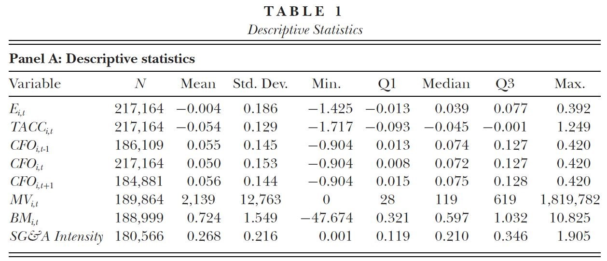

```{r setup, message=FALSE, warning=FALSE, include=FALSE}
knitr::opts_chunk$set(fig.pos = 'p') # Places figures on their own pages
knitr::opts_chunk$set(out.width = '100%', dpi=300)
knitr::opts_chunk$set(echo=FALSE, message=FALSE, warning=FALSE)

source("../code/utils.R")
source("../code/samples.R")
source("../code/tables.R")
source("../code/figures.R")
source("../code/videos.R")

pkgs <- c("devtools", "Quandl", "gtools", "ggpubr", "lfe", "tidyverse", 
          "lubridate", "broom", "tweenr", "moments", "Hmisc", "RCurl", 
          "ggridges", "latex2exp", "knitr", "kableExtra",  
          "nteetor/gganimate@71da746", "joachim-gassen/ExPanDaR@11b4f4b")

invisible(lapply(pkgs, install_pkg_if_missing))
invisible(lapply(pkgs, attach_pkg))

opts_knit$set(root.dir = "..")

# This code relies on the WRDS and some additional data 
# being present in the data/ directory. 
# 
# To make sure that this is the case, run 'produce_findings.R' 
# in the project's root directory prior to knitting this file.
#
# Refer to the Appendix in the paper for additional guidance

needed_data_files <- c("../data/cpiauscl.RDS",
                       "../data/iso3_country_names.RDS",
                       "../data/cstat_us_sample.RDS",
                       "../data/cstat_int_sample.RDS")
if (!all(file.exists(needed_data_files))) 
  stop("Data not downloaded. Please run 'produce_findings.R prior to knitting this file")

refresh <- FALSE
```

``` {r sample, include=FALSE, cache=TRUE}
list2env(prepare_us_samples(), environment())
list2env(prepare_int_samples(), environment())
```

\pagebreak

# Introduction
  
The scientific community widely agrees that reproduction (understood here as reproducing findings using the same sample and method) and replication (understood here as retesting findings using a new sample while applying the same method) of empirical results are a central building block of sound empirical evidence. Yet, published reproduction or replication studies in economics are rare (@DPR).  While several reasons for this observation have been discussed by prior literature, most commentators agree that the lack of established reproducible workflows makes reproductions and replications inherently costly to do (@GGR). 

This work-in-progress note aims to promote reproductions of empirical archival studies in three ways: First, we show that reproducing and extending the findings of an influential accounting scan provide additional insights into such fundamental research questions as the association between accruals and cash flows. Second, we gain our insights by using exploratory data analysis and visualization tools. This data exploration workflow can be adopted by future researchers to explore and extend existing evidence. Third, our research note aims to reduce the costs of future reproductions and extensions of archival studies in two ways: For one, we apply an open science workflow that allows researchers to immediately use and build on our underlying code and data. For another, we develop and provide the ExPanD toolbox that allows interactive exploratory panel data analysis in a web-based environment. This toolbox enables researchers to provide their readers the opportunity to assess the robustness of findings without providing them the access to potentially proprietary or commercialized data.

The resulting reduction in reproduction costs should have the following three effects: (a) By allowing readers to explore and re-use both data and code, results can be reproduced quicker. (b) Using ExPanD, it becomes significantly easier for interested readers to assess the robustness of empirical archival work, reducing the risk of p-hacking and increasing the confidence in published results. (c) It allows interested researchers to more efficiently build on prior evidence, potentially yielding quicker evolution of scientific knowledge.

To demonstrate the usefulness of our workflow, we reproduce and extend a study addressing a key area of interest to empirical archival researchers in the area of financial accounting: the statistical properties of cash flow/accrual relation. The central objective of accruals is to smooth temporary fluctuations in cash flows, thereby increasing the informativeness of earnings. This accounting activity results in a negative association between accruals and concurrent cash flows from operations. @BLZ (BLZ from now on) analyze the time trend of this association for U.S. firms and provide compelling evidence that the negative association between accruals and cash flow from operations diminishes over time. They also document that this trend cannot easily be explained by changes in the sample composition, changes in the asymmetric timeliness of earnings or by industry trends. Their main explanation for the finding is the increase of non-timing related accrual recognition and the increasing frequency of loss years. 

We revisit and extend the findings of BLZ by applying a workflow consisting of the following four steps: 

(i)  *Reproduction* (same research design, same population, same sample): 
We reproduce the sample and key variables of BLZ as well as their main findings. 
(ii) *Robustneess testing* (same research design, same population, split original sample into sub-samples):
We assess the overall robustness of the main finding by re-running the original model specification on different sub-samples. We partition the original sample based on key variables of interest in order to assess robustness of the main findings across sub-samples (e.g., across firm-size deciles, industries, etc.). 
(iii) *Exploration* (modified research design, same population, same sample):
Having assessed the robustness of the finding we revisit the explanations offered by BLZ. By using different model specifications and state of the art tools for data visualization we offer additional insights into the driving forces behind the diminishing cash flow/accrual association.
(iv) *Replication and extension* (same and modified research design, different population, different sample):
Finally, we analyze the extent to which the key findings of BLZ are generalizable to different populations of firms by replicating their study using an international sample of firms. In addition, we verify that our alternative explanation for the changing cash flow/accrual association holds out-of-sample internationally. 

Our findings highlight the benefits of applying this workflow when reproducing and/or replicating  empirical studies. We successfully reproduce a current and prominent financial accounting study to show that its main finding is robust across industries and for small and large firms. Our exploration reveals that the distribution of operating cash flows is changing significantly over time and that this appears to be a major explanation for the shift in the cash flow/accrual association observed by BLZ. The change in the cash flow distribution and the diminishing cash flow/accrual association is also observable for the international sample and the associated time-trend is surprisingly robust across countries.

A concurrent working paper which also builds on the findings of BLZ is @NSV. The authors investigate the role of earnings and cash flow from operations for the predictability of future cash flows. Interestingly, they find that the explanatory power of operating cash flows (to predict future operating cash flows) increases over time. They observe that the explanatory power of operating cash flows is associated with "decreasing operating cycles, decreasing working capital and increasing intangible intensity". They show that these results generalize to an international sample of firms. While @NSV explore the effect of BLZ's findings on the predictive power of operating cash flows and accruals, we focus our extension on understanding the drivers of the diminishing association between accruals and cash flows better.

Our key data set underlying our extension is available for user-side exploration online ([click here to ExPanD](https://jgassen.shinyapps.io/ExpAcc)). Furthermore, the code used to generate our results and this paper is publicly available on Github. By applying this open science workflow for reproducing and replicating prior studies we enable researchers to build on our findings and to continue exploring the landscape of accrual accounting. Readers who have access to national and international Compustat data via the WRDS interface should be able to reproduce all of our findings easily by following the reproduction steps detailed in the Appendix.

In addition, we provide a tool that reduces the costs associated with future reproduction studies: The interactive panel data exploration toolbox ExPanD facilitates systematic data exploration and robustness checking in a web-based environment. The code for ExPanD has been developed with the objectives of accessibility and re-usability in mind and is available as a separate R package (["ExPanDaR"](https://github.com/joachim-gassen/ExPanDaR)). It can be used with generic panel data sets online ([click here](https://jgassen.shinyapps.io/expand)) and easily adapted to host specific panel data for secure online user-side exploration.

# Reproduction of @BLZ

We choose with BLZ a study for our reproduction and replication exercise that (i) provides an important finding, which is broad in its scope and substantially influences future financial accounting research, (ii) is exploratory in nature and raises related research questions that we might be able to address by further data explorations within-sample or out-of-sample and (iii) which facilitates reproduction (e.g., publicly available data, rigorous documentation of data collection, sample selection and research design). 

BLZ document that the negative association between accruals and concurrent cash flows in the U.S. decreased substantially over time and virtually disappeared in recent years. This finding is very relevant for our field as the properties of accruals are key drivers of established measures for earnings quality and earnings management (e.g., @J, @D, @DD, @DGS for an overview). As BLZ indicate in their study, work that is using such measures might be picking up overall time trends when designing tests (partially) relying on the time dimension for identification such as difference-in-differences designs. Given that the common trend assumption is critical for these designs, a key research question of @BLZ (and in some regard also of our study) is the identification of cross-sectional variation that helps to explain this striking time-series pattern.

Another reason why the findings of BLZ are a good candidate for exploration and extensions is the magnitude of the additional tests and extensions that the authors themselves provide. To some extent, BLZ can itself be classified as exploratory. By using visual exploratory data analysis tools in our study, we can make the fascinating findings of BLZ more accessible to the reader, potentially allowing future work to chart the accrual landscape at an even higher level of detail.

```{r vardef, paged.print=FALSE, results="asis"}
vd <- readRDS("raw_data/blz_var_definitions.RDS")
Variable <- paste0("$", gsub("_", "", toupper(vd[c(7:8, 11:12, 6, 5, 14), 1])), "_t$")
definition <- c(
  "$0.5AT_{t-1} + 0.5AT_t$",
  "$IB_t/AVGAT_t$",
  "If $(year > 1987)$ $(IBC_t - OANCF_t) / AVGAT_t$ else $(ACT_t - ACT_{t-1} - (CHE_{t} - CHE_{t-1}) - ((LCT_t - LAG_{t-1}) - (DLC_t - DLC_{t-1})) - DP_t) / AVGAT_t$",
  "If $(year > 1987)$ $OANCF_t / AVGAT_t$ else $E_t - TACC_t$",
  "$PRCCF_t * CSHO_t$",
  "$CEQ_t / MV_t$",
  "$XSGA_t /(SALE_t - IB_t)$"
  )
  
Description <- c(
  "Average total assets in M US-\\$",
  "Earnings deflated by average total assets",
  "Total accruals, derived from earnings and cash flow from operations as reported in the cash flow statement after 1987 and from the balance sheet before, deflated by average total assets",
  "Cash flow from operations, as reported in the cash flow statement after 1987 and derived from the balance sheet before, deflated by average total assets",
  "Market value of common stock in M US-\\$",
  "Book-to-market ratio based on common stock",
  "SG\\&A Intenisty: Share of total cost that can be attributed to selling, general and administrative expenses"
)

vt <- data.frame(Variable, definition, Description, stringsAsFactors = FALSE)
names(vt)[2] <- 'Compustat definition'

kable(vt, format = "latex",
      caption = "\\label{tab:vardef}Variable Definitions",
      row.names = FALSE, booktabs = TRUE, escape = FALSE, linesep = "") -> kab_latex

lat_tab <- unlist(strsplit(kab_latex, "\n"))
lat_tab[6] <- "\\\\[-1.8ex]\\hline \\hline \\\\[-1.8ex]"
lat_tab[8] <- "\\\\[-1.8ex]\\hline \\hline \\\\[-1.8ex]"
lat_tab[length(lat_tab) - 2] <- "\\\\[-1.8ex]\\hline \\hline \\\\[-1.8ex]"
new_lat_tab <- lat_tab[1:8]
for (i in 9:15) {
  new_lat_tab[2*i - 9] <- lat_tab[i]
  if (i!= 15) new_lat_tab[2*i - 8] <- "\\hline\\\\[-1.8ex]"
}
new_lat_tab <- c(new_lat_tab, lat_tab[16:length(lat_tab)])

latex_tab <- c("\\begin{table}[!htbp]",
               new_lat_tab[3],
               "\\centering",
               "\\begin{threeparttable}",
               "\\begin{tabular}[t]{lP{6cm}P{8cm}}",
               new_lat_tab[6:(length(new_lat_tab) - 1)],
               "\\begin{tablenotes}[flushleft]",
               "\\setlength{\\labelsep}{0pt}",
               "\\footnotetext",
               "\\item Note: The variable defintions follow BLZ, p. 75 f. All data and data mnemonics are from Compustat.",
               "\\end{tablenotes}",
               "\\end{threeparttable}",
               "\\end{table}")
cat(paste(latex_tab, collapse = "\n"))  
```


We start by reproducing the sample of BLZ, thereby following the sample selection steps and the variable definitions of BLZ as closely as possible. First, we create a `r format(file.info("data/cstat_us_sample.RDS")$mtime, "%B %d, %Y")` dump of the Compustat US North America fundamentals data base with standard screens. Second, we generate the variables used in BLZ by following their definitions (Table \ref{tab:vardef} shows our resulting variable definitions). We translate currency values denominated in foreign currencies to US-\$. Third, we apply the additional sample screens and the by-year winsorizing procedure described in BLZ, p.49f. This means that we delete observations from the financial services industry, observations from years with significant mergers/acquisitions activity and observations with missing cash flow or accrual data. In addition, we limit the sample to the periods 1964 to 2014. We refer the resulting sample as the reproduced sample. Its descriptive statistics are displayed in Table \ref{tab:descriptives_rs}.

```{r descriptives_rs, cache = TRUE, echo = FALSE, results="asis"}
t <- prepare_descriptive_table(rep_sample[, c("e", "tacc", "lagcfo", 
                                             "cfo", "leadcfo", "mv", 
                                             "bm", "sgaint")])
rownames(t$df) <- c("$E_t$", "$TACC_t$", "$CFO_{t-1}$", "$CFO_t$", "$CFO_{t+1}$", "$MV_t$",
                    "$BM_t$", "$SGAINT_t$")
names(t$df)[c(5,7)] <- c("25 \\%", "75 \\%")
kable(t$df, digits = c(0, 3, 3, 3, 3, 3, 3, 3), format = "latex",
      caption = "\\label{tab:descriptives_rs}Descriptive Statistics Reproduced Sample",
      format.args = list(decimal.mark = ".", big.mark = ",", 
                         scientific=FALSE),
      booktabs = TRUE, escape = FALSE, linesep = "") -> kab_latex

lat_tab <- unlist(strsplit(kab_latex, "\n"))
lat_tab[6] <- "\\\\[-1.8ex]\\hline \\hline \\\\[-1.8ex]"
lat_tab[8] <- "\\hline\\\\[-1.8ex]"
lat_tab[length(lat_tab) - 2] <- "\\\\[-1.8ex]\\hline \\hline \\\\[-1.8ex]"

latex_tab <- c("\\begin{table}[!htbp]",  
               lat_tab[3],
               "\\begin{threeparttable}",
               lat_tab[5:(length(lat_tab) - 1)],
               "\\begin{tablenotes}[flushleft]",
               "\\setlength{\\labelsep}{0pt}",
               "\\footnotetext",
               "\\item Note: This reproduced sample contains annual Compustat North America data for the period 1964 to 2014. The sample selection process follows the procedure described in BLZ, p.49f: We delete observations from the financial services industry, observations from years with significant mergers/acquisitions activity and observations with missing cash flow or accrual data. Also in line with BLZ, we by-year winsorize the data to the top and bottom percentile. Variables are as defined in Table \\ref{tab:vardef}.",
               "\\end{tablenotes}",
               "\\end{threeparttable}",
               "\\end{table}")
cat(paste(latex_tab, collapse = "\n"))  
```

For reference, Figure \ref{fig:blz_descriptives} displays the descriptive statics of the original BLZ sample as presented in Panel A of BLZ's Table 1. We note several differences between the sample of BLZ and our sample. First, our sample is larger then the sample of BLZ (`r format(length(rep_sample$cfo), big.mark = ",") ` versus 217,164 observations of BLZ). Second, firms in our sample seem to be significantly smaller than the firms of BLZ (mean market value in reproduced sample M US-\$ `r format(mean(rep_sample$mv, na.rm=TRUE), big.mark = ",", digits = 3)` versus 2,139 of BLZ).

```{r blz_descriptives, echo = FALSE, out.height = "6cm", fig.align="center", fig.cap="\\label{fig:blz_descriptives}Table 1, Panel A of BLZ"}

```

We assume that our initial Compustat data screens differ from the screens that BLZ applied, as our sample appears to include additional firms that tend to be relative small in terms of the market value. In order to make our sample more comparable to the one used in BLZ we apply an additional screen and exclude firms with average total assets below M US-\$ 7.5 from our sample (prior to winsorizing the data). We label the resulting sample as the test sample. Table \ref{tab:descriptives_ts} reports its descriptive statistics.

```{r descriptives_ts, cache = TRUE, echo = FALSE, results="asis"}

t <- prepare_descriptive_table(test_sample[, c("e", "tacc", "lagcfo", 
                                               "cfo", "leadcfo", "mv", 
                                               "bm", "sgaint")])
rownames(t$df) <- c("$E_t$", "$TACC_t$", "$CFO_{t-1}$", "$CFO_t$", "$CFO_{t+1}$", "$MV_t$",
                    "$BM_t$", "$SGAINT_t$")
names(t$df)[c(5,7)] <- c("25 \\%", "75 \\%")

kable(t$df, digits = c(0, 3, 3, 3, 3, 3, 3, 3), format = "latex",
      caption = "\\label{tab:descriptives_ts}Descriptive Statistics Test Sample",
      format.args = list(decimal.mark = ".", big.mark = ",", 
                         scientific=FALSE),
      booktabs = TRUE, linesep = "", escape = FALSE) -> kab_latex

lat_tab <- unlist(strsplit(kab_latex, "\n"))
lat_tab[6] <- "\\\\[-1.8ex]\\hline \\hline \\\\[-1.8ex]"
lat_tab[8] <- "\\hline\\\\[-1.8ex]"
lat_tab[length(lat_tab) - 2] <- "\\\\[-1.8ex]\\hline \\hline \\\\[-1.8ex]"

latex_tab <- c("\\begin{table}[!htbp]",  
               lat_tab[3],
               "\\begin{threeparttable}",
               lat_tab[5:(length(lat_tab) - 1)],
               "\\begin{tablenotes}[flushleft]",
               "\\setlength{\\labelsep}{0pt}",
               "\\footnotetext",
               "\\item Note: The test sample is based on the reproduced sample reported in Table \\ref{tab:descriptives_rs}. In addition to the sampling process described there, observations with $AVGAT$ below M US-\\$ 7.5 are excluded. Variables are as defined in Table \\ref{tab:vardef}.",
               "\\end{tablenotes}",
               "\\end{threeparttable}",
               "\\end{table}")
cat(paste(latex_tab, collapse = "\n"))  

```

After applying this additional screen, our sample appears to be reasonably close, both in terms of sample size and descriptive statistics, to the BLZ sample presented in Figure \ref{fig:blz_descriptives}. The only noteworthy exemption is that the extreme values of TACC presented by BLZ (Minimum -1.717 and Maximum 1.249) are substantially larger compared to the extreme values presented in our test sample (Minimum `r format(min(test_sample$tacc), digits = 3)` and Maximum `r format(max(test_sample$tacc), digits = 3)`).

Despite these remaining differences, we continue by reproducing the main finding of BLZ. Therefore, we estimate yearly regressions of the following model:

\begin{equation}
\label{level_reg}
TACC_{t,i} = \beta_0 + \beta_1 CFO_{t,i} + \epsilon_{t,i}
\end{equation}

```{r level_results, cache = TRUE, echo = FALSE, fig.cap="\\label{fig:level_results}Regression results for yearly estimates of model (\\ref{level_reg}) compared to results of BLZ, Table 2"}
us_ys <- prepare_us_yearly_sample(test_sample)
prepare_fig_rep_blz_results(us_ys, "level", "cfo")
```

The left hand side of Figure \ref{fig:level_results} presents the $\beta_1$ coefficient over time along with the original coefficients reported in Table 2 of BLZ. It shows that our results are very similar to the key result reported in Table 2 of BLZ. In both cases, we observe a steady increase in $\beta_1$ over time indicating that the cash flow/accrual association weakens over time. Furthermore, our results in terms of the adjusted $R^2$ (right-hand side of Figure \ref{fig:level_results}) mirror the findings of BLZ and illustrate the pronounced decline in the correlation between accruals and cash flows over time. Our successful reproduction of the key BLZ findings provides us with confidence that our test sample is close enough to the original sample of BLZ. Thus, we proceed by assessing the overall robustness of the BLZ finding.

# Robustness

We partition our test sample in order to assess the robustness of the main BLZ finding across sub-samples. We are particularly interested whether the diminishing accrual/cash flow relation is observable (i) across industries, (ii) for small as well as large firms and (iii) for firm-year observations with a low and a high magnitude of operating cash flows. For each sub-sample, we re-run the yearly regressions based on model \ref{level_reg}. In the second step, we use the generated beta coefficients (or Adjusted $R^2s$) and regress them on the variable $TIME$ (coded as $year-1964$): 

\begin{equation}
\label{time_reg}
\beta_{1,t} [Adj. R^2_t]= b_0 +b_1 TIME_t +\epsilon_t
\end{equation}

The values for $b_1$ are plotted for the different sub-samples. A larger $b_1$ illustrates a more pronounced decline of the accrual/cash flow association over time for the respective sub-sample. When sub-sampling by firm size, we use average total assets but adjust the value for inflation by using the consumer price index as provided the U.S. Department of Labor. We use December 2014 as our indexing period. When sub-sampling by industry, we plot all industries that, according to the Fama/French 48 industries classification, have at least 10 observations for all years in the period 1964-2014.
 
``` {r level_by_at, cache = TRUE, fig.cap="\\label{fig:level_by_at}$TIME$ coefficient of model (\\ref{time_reg}) by size deciles"}
prepare_fig_level_by_at(test_sample, "cfo_est")
```

As illustrated by Figure \ref{fig:level_by_at}, the time trend documented by BLZ manifests itself across all size groups but appears somewhat smaller for larger firms. BLZ already indicate that the diminishing association between cash flows and accruals is more pronounced for loss firms. As small firms are also more frequently reporting losses, our observations is well in line with the observations of BLZ. Next we turn to exploring the time trends across industries. 

``` {r level_by_ind, cache = TRUE, fig.height = 6, fig.cap="\\label{fig:level_by_ind}$TIME$ coefficient of model (\\ref{time_reg}) by Fama/French industries"}
prepare_fig_level_by_ind(test_sample, "cfo_est")
```


Also in line with BLZ, Figure \ref{fig:level_by_ind} documents that the time trend can be observed across virtually all industries. There does not appear to be an obvious systematic variation across industries. Finally, we plot the model coefficients across deciles of $CFO$, the independent variable of the model (\ref{level_reg}). 

``` {r fig_level_by_cfo, cache = TRUE, fig.cap="\\label{fig:level_by_cfo}$TIME$ coefficient of model (\\ref{time_reg}) by $CFO$ deciles"}
prepare_fig_level_by_cfo(test_sample, "cfo_est")
```


Figure \ref{fig:level_by_cfo} shows that the time trend (of the diminishing accrual/cash flow association) is strongly moderated by the magnitude of operating cash flows. BLZ already show that the relationship between accruals and cash flows is weaker in years for which a higher fraction of firms report losses. However, we prefer to partition our sub-sample based on cash flows (rather than earnings) as they are not influenced by the dependent variable of model (\ref{level_reg}). We next explore whether the time trend with respect to the adjusted $R^2$ of model (\ref{level_reg}) varies systematically across sub-samples with different operating cash flows. Figure \ref{fig:level_by_cfo_r2} communicates the result.

``` {r level_by_cfo_r2, cache = TRUE, fig.cap="\\label{fig:level_by_cfo_r2}$TIME$ coefficient of model (\\ref{time_reg}) with $Adj. R^2$ as dependent variable by cash flow deciles"}
prepare_fig_level_by_cfo(test_sample, "adjr2")
```

This pattern is striking as it indicates that the drop in $Adj. R^2$ described in BLZ seems to be driven by extreme cash flow observations. To explore this fact a little bit further, Figure \ref{fig:level_by_cfo_comp} plots the time trends separately for firms within the first, fifth and tenth decile of $CFO$. It becomes apparent from the plot that the explanatory power of cash flows for accruals tends to lie in the extremes. Given that the bins at the extreme deciles are wider this is not entirely surprising. What seems more relevant is that the coefficient trend differs clearly across the extremes. For the sub-sample with particularly low cash flows the negative association between accruals and cash flows clearly diminishes at the end of the sample period. In contrast, for firms with particularly high cash flows, the association seems to be more persistent (positive R² and negative coefficient throughout the sample period). 

``` {r level_by_cfo_comp, cache = TRUE, fig.cap="\\label{fig:level_by_cfo_comp}$CFO$ coefficients and $Adj. R^2$ of model (\\ref{level_reg}) by cash flow deciles"}
prepare_fig_level_comp(test_sample, "cfo")
```

While we observe a negative association between cash flows and accruals for all sub-samples at the beginning of the sample period, the association becomes positive for the low cash flow sub-sample and remains negative for the high cash flow sub-sample. This might indicate a change in the functional form of the association between cash flows and accruals. 

The functional form of the cash flow-accrual relation has also been investigated by BLZ to some extent by exploring asymmetric timeliness variants of model (\ref{level_reg}) in spirit of @BS. However, BLZ do not explore varying functional forms of the association between cash flows and accruals as a main driver of the overall time trend. We will pursue this avenue in the next section.


# Exploration

To explore the development of the functional relation of cash flows from operations and total accruals over time, we estimate locally estimated smooth regressions for yearly samples. The result can be visualized by a video ([click here to see video](https://www.wiwi.hu-berlin.de/rewe/research/test_samplecfo_tacc_scatter.mp4)) or by comparing the functional forms across two samples, one spanning the beginning of the sample period (1964-1973) and one spanning the end of the sample period (2005-2014).

``` {r scatter_sbs, cache = TRUE, dev = "png", fig.height = 6, fig.cap="\\label{fig:scatter_sbs} $CFO$ and $TACC$ scatter plots (sample of 20,000 observations for each period)"}
prepare_fig_scatter_sbs(test_sample)
```

Figure \ref{fig:scatter_sbs} and the video display a stark contrast in the estimated functional form. For the beginning of the sample period the relation is almost perfectly linear. However, towards the end of the sample period the relation is highly non-linear, exhibiting a kinked regression curve very much in line with the idea of asymmetric timeliness of accruals as suggested by @BS. Note that the strong difference in the functional forms across periods is not driven by an increasing sample size, as we plot 20,000 observations for each period. 

The change in the functional form seems to be mainly driven by two types of firm-year observations that were not observable in the early sample periods: (i) observations with extremely low operating cash flows (ii) firm-year observations with moderate levels of operating cash flows but particularly low accruals. This results in a positive (negative) accrual/cash flow association for firm-year observations with negative (positive) cash flows towards the end of the sample period. Again, this finding is in line with Figure \ref{fig:level_by_cfo_comp}, which indicated that the accrual/cash flow association is strongly moderated by the magnitude of operating cash flows. 

What also becomes apparent is that the distribution of cash flows and accruals becomes more dispersed towards the end of the sample period. To visualize the change in the distribution of operating cash flows over time, we plot density estimates over the sample years in Figure \ref{fig:cfo_density_ridge}.

``` {r cfo_density_ridge, cache = TRUE, fig.cap="\\label{fig:cfo_density_ridge}Density of $CFO$ over time"}
prepare_fig_cfo_density_ridge(test_sample)
```

Towards the end of the sample period the distribution of cash flow from operations becomes significantly wider. Particularly, the increase of relatively large negative cash flows over time is striking and likely to be influential for the observed change in functional form. Thus, we proceed by assessing the influence of this change in the cash flow distribution on the findings of BLZ. 

BLZ already explore whether an increase in cash flow shocks over time might explain the attenuation of the accrual/cash flow association, but do not find that it significantly contributes to the effect (Table 4 of BLZ). However, due to the observable change in the functional form we would like to explore the impact of the changing cash flow distribution in more detail. 

Similar to model (\ref{time_reg}), we use the yearly beta coefficients (or adjusted $R^2$) from model (\ref{level_reg}) as our dependent variable and regress them on $TIME = year - 1964$ as well as on one or multiple of the following distributional properties of the operating cash flow, which we determine annually for the cross-section: mean ($CFO\_MEAN$), standard deviation ($CFO\_SD$), skewness ($CFO\_SKEW$) and kurtosis ($CFO\_KURT$). Keep in mind that we scale cash flow from operations by average total assets and winsorize the variable by year in order to generate $CFO$. 

\begin{equation}
\begin{aligned}
\label{full_cfo_reg}
\beta_{1,t} [Adj. R^2_t] = &b_0 +b_1TIME_t + b_2CFO\_MEAN_t + b_3CFO\_SD_t  + \\ 
&b_4CFO\_SKEW_t + b_5CFO\_KURT_t +\epsilon_t
\end{aligned}
\end{equation}

In addition, we are interested in whether $TIME$ explains any remaining variance after controlling for changes in the underlying cash flow distribution. For this reason, we regress the residual variance (after controlling for the moments of the cash flow distribution but not time) on $TIME$.  

\begin{equation}
\label{resid_cfo_reg}
RESID_{CFO,t} [RESID_{Adj. R^2,t}]= b_0 +b_1 TIME_t +\epsilon_t
\end{equation}
 
The results in Table \ref{tab:dist_tests_cfo} and Table \ref{tab:dist_tests_adjr2} indicate that a large part of the diminishing cash flow/accrual association can be explained by changes in the underlying cash flow distribution. In particular, it appears that the association between accruals and operating cash flows weakens as the cash flow distribution becomes more dispersed (in terms of its standard deviation) and more left-skewed (more observations with particularly negative cash flows).


``` {r dist_tests_cfo, cache = TRUE, results="asis"}
dist_test <- prepare_tab_impact_cfo_dist_us(us_ys)
dist_test[[1]]$table[12] <- "\\\\[-1.8ex] & $\\beta_1$ & $\\beta_1$ & $\\beta_1$ & $\\beta_1$ & $\\beta_1$ & $\\beta_1$ & $RESID_{CFO}$ \\\\ "

latex_tab <- c("\\begin{table}[!htbp]",
               "\\caption{\\label{tab:dist_tests_cfo}Test for association of $CFO$ distribution statistics with model (\\ref{level_reg}) $\\beta_1$ coefficient}",
               "\\centering",
               "\\small",
               "\\begin{threeparttable}",
               "\\setlength{\\tabcolsep}{2pt}",
               "\\begin{tabular}{lcccccccc}",
               dist_test[[1]]$table[8:14],
               toupper(sub(pattern = "(\\b[a-zA-Z\\\\_]+\\b)", "$\\1$", dist_test[[1]]$table[15:31])),
               dist_test[[1]]$table[32:45],
               "\\end{tabular}",
               "\\begin{tablenotes}[flushleft]",
               "\\setlength{\\labelsep}{0pt}",
               "\\footnotetext",
               "\\item Note: This table reports OLS regression results for the respective variants of model (\\ref{full_cfo_reg}) (columns 1-6) and model (\\ref{resid_cfo_reg}) (column 7). The dependent variable in columns 1-6 is the annual $\\beta_1$ coefficient of model 1. In column 7, the dependent variable $RESID_{CFO}$ is the residual of a variant of model (\\ref{full_cfo_reg}) including all $CFO$ moments but not $TIME$. For the independent variables the identifiers after the underscore indicate the repspective moment of the annual $CFO$ distribution. $TIME$ is a yearly indicator $= year - 1964$. For the full model in column 6, variance inflation factors are reported in square brackets below the standard errors, which are reported in parantheses. $^{*}$/$^{**}$/$^{***}$ indicate two-sided significane levels of 10/5/1 \\%, respectively.",
               "\\end{tablenotes}",
               "\\end{threeparttable}",
               "\\end{table}")

cat(paste(latex_tab, collapse = "\n"))
```

``` {r dist_tests_adjr2, cache = TRUE, results="asis"}
dist_test[[2]]$table[12] <- "\\\\[-1.8ex] & $Adj. R^2$ & $Adj. R^2$ & $Adj. R^2$ & $Adj. R^2$ & $Adj. R^2$ & $Adj. R^2$ & $RESID_{Adj. R^2}$ \\\\ "
latex_tab <- c("\\begin{table}[!htbp]",  
               "\\caption{\\label{tab:dist_tests_adjr2}Test for association of $CFO$ distribution statistics with model (\\ref{level_reg}) $Adj. R^2$}",
               "\\centering",
               "\\small",
               "\\begin{threeparttable}",
               "\\setlength{\\tabcolsep}{2pt}",
               "\\begin{tabular}{lcccccccc}",
               dist_test[[2]]$table[8:14],
               toupper(sub(pattern = "(\\b[a-zA-Z\\\\_]+\\b)", "$\\1$", dist_test[[2]]$table[15:31])),
               dist_test[[2]]$table[32:45],
               "\\end{tabular}",
               "\\begin{tablenotes}[flushleft]",
               "\\setlength{\\labelsep}{0pt}",
               "\\footnotetext",
               "\\item Note: This table reports OLS regression results for the respective variants of model (\\ref{full_cfo_reg}) (columns 1-6) and model (\\ref{resid_cfo_reg}) (column 7). The dependent variable in these columns 1-6 is the annual $Adj. R^2$ of model (\\ref{level_reg}). In column 7, the dependent variable $RESID_{Adj. R^2}$ is the residual of a variant of model (\\ref{full_cfo_reg}) including all $CFO$ moments but not $TIME$. For the independent variables the identifiers after the underscore indicate the repspective moment of the annual $CFO$ distribution. $TIME$ is a yearly indicator $= year - 1964$. For the full model in column 6, variance inflation factors are reported in square brackets below the standard errors, which are reported in parantheses. $^{*}$/$^{**}$/$^{***}$ indicate two-sided significane levels of 10/5/1 \\%, respectively.",
               "\\end{tablenotes}",
               "\\end{threeparttable}",
               "\\end{table}")
cat(paste(latex_tab, collapse = "\n"))
```

After controlling for changes in the cash flow distribution, time is no longer significantly associated with the residual variance in $Adj. R^2$ and $\beta_1$ (see column 7 of Table \ref{tab:dist_tests_cfo} and Table \ref{tab:dist_tests_adjr2} which are based on model (\ref{resid_cfo_reg}). It has to be stated, however, that this test is very aggressive as it tests for explanatory power of time after purging out the explanatory power of the changing properties of the cash flow distribution. The results in column 6 illustrate that in models where time is being included as an explanatory variable concurrently with the distributional properties of operating cash flow, the time dimension maintains its significance, albeit with exceptionally high variance inflation factors.

``` {r corr_yearly_us_sample, cache = TRUE, results="asis"}
tab <- prepare_correlation_table(us_ys[,c(3:8, 13, 17, 36, 37, 42)], format = "latex", booktabs = TRUE, linesep = "")
tab$kable_ret <- gsub("%", "\\%", tab$kable_ret)
tab$kable_ret <- gsub("_", "\\\\_", tab$kable_ret)
lat_tab <- unlist(strsplit(tab$kable_ret, "\n"))
lat_tab[7:17] <- sub("(\\b[a-zA-Z2\\\\_]{2,}\\b)", "\\U$\\1$", lat_tab[7:17], perl = TRUE)
lat_tab[13] <- sub("\\$.*\\$", "$\\\\beta_1$", lat_tab[13])
lat_tab[14] <- sub("\\$.*\\$", "$Adj. R^2$", lat_tab[14])
lat_tab[15] <- sub("\\$.*\\$", "$RESID_{CFO}$", lat_tab[15])
lat_tab[16] <- sub("\\$.*\\$", "$RESID_{Adj. R^2}$", lat_tab[16])
lat_tab[4] <- "\\\\[-1.8ex]\\hline \\hline \\\\[-1.8ex]"
lat_tab[6] <- "\\hline\\\\[-1.8ex]"
lat_tab[18] <- "\\\\[-1.8ex]\\hline \\hline \\\\[-1.8ex]"
latex_tab <- c("\\begin{table}[!htbp]",  
               "\\caption{\\label{tab:corr_yearly_us_sample}Correlation table for yearly U.S. sample}",
               "\\centering",
               "\\small",
               "\\begin{threeparttable}",
               "\\setlength{\\tabcolsep}{5pt}",
               lat_tab[3:19],
               "\\begin{tablenotes}[flushleft]",
               "\\setlength{\\labelsep}{0pt}",
               "\\footnotetext",
               lat_tab[21:23],
               "\\end{table}")
latex_tab[27] <- paste(latex_tab[27], "For variables starting with $CFO$, the identifiers after the underscore indicate the repspective moment of the annual $CFO$ distribution. For variables starting with $level$, the identifiers after the underscore indicate the respective statistic based on models (\\ref{full_cfo_reg}) and (\\ref{resid_cfo_reg}). $TIME$ is a yearly indicator $= year - 1964$.")
cat(paste(latex_tab, collapse = "\n"))               
```

A look at the correlation coefficients in Table \ref{tab:corr_yearly_us_sample} reveals that $TIME$ is highly correlated with the properties of the cash flow distribution. For instance, the Pearson correlation coefficient for $TIME$ and $CFO\_SD$ is `r format(cor(us_ys$time, us_ys$cfo_sd), digits = 2)`. This might explain why BLZ do not find a significant impact of the standard deviation of cash flows on the cash flow/accrual association (see Table 4 of BLZ). Given these strong correlations and the resulting high variance inflation factors in columns 6 of Table \ref{tab:dist_tests_cfo} and Table \ref{tab:dist_tests_adjr2}, we believe that it is unfeasible to separate a general time effect from the effect of the change in the cash flow distribution within a sample of 51 annual observations.

# International Replication

In order to address this concern and to explore whether the diminishing cash flow/accrual association is observable for firms outside of the US, we use an international sample of firms obtained from Compustat Global. We apply the original BLZ screens, but not our additional size screen, in order to generate the international sample. In addition, we do not drop firm-year observations with significant acquisition activity, given that the Compustat item (# aqs) is not available internationally. As original cash flow data is sparse in the early years of the international data, we replace original cash flow and accruals data with balance sheet based measures whenever original cash flow data are not observable. To be included in our international country-year sample, we require (i) each country-year to have at least 30 firm-year observations and after applying this filter (ii) each country to have at least 20 country-years. For country-years with at least (less) than 100 firm-years we winsorize the extreme 1% (5%) observations on either side for each of our continuous variables. The resulting sample period spans from `r format(min(int_test_sample$year))` to `r format(max(int_test_sample$year))`. 

```{r world_sample, cache = TRUE, results = "asis"}
ctr_year_sample <- prepare_int_yearly_sample(all20_ctry_sample)
time_effects <- estimate_int_time_effect(ctr_year_sample)
df <- all20_ctry
names(df) <- c("ISO code", "Country", "# years", "# observations")
kable(df, format = "latex", booktabs = T, linesep = "",
      format.args = list(decimal.mark = ".", big.mark = ",", 
                         scientific=FALSE)) -> kab_latex

lat_tab <- unlist(strsplit(kab_latex, "\n"))
lat_tab[3] <- "\\\\[-1.8ex]\\hline \\hline \\\\[-1.8ex]"
lat_tab[5] <- "\\hline\\\\[-1.8ex]"

latex_tab <- c("\\begin{table}[!htbp]",  
               "\\caption{\\label{tab:world_sample}International sample: Number of observations and years per country}",
               "\\centering",
               "\\small",
               "\\begin{threeparttable}",
               "\\setlength{\\tabcolsep}{4pt}",
               lat_tab[2:31],
               "\\hline\\\\[-1.8ex]",
               paste0("Total & & ", 
                      format(nrow(ctr_year_sample), big.mark = ","), 
                      " & ", 
                      format(nrow(all20_ctry_sample), big.mark = ","), 
                      "\\\\"),
               "\\\\[-1.8ex]\\hline \\hline \\\\[-1.8ex]",
               "\\end{tabular}", 
               "\\begin{tablenotes}[flushleft]",
               "\\setlength{\\labelsep}{0pt}",
               "\\footnotetext",
               "\\item Note: Country year sample for international analyes. All countries with at least 20 years of data are included. A minimum of 30 firm-year observations is required to estimate the sample statistics for each country year to be included in this sample.",
               "\\end{tablenotes}",
               "\\end{threeparttable}",
               "\\end{table}")
cat(paste(latex_tab, collapse = "\n"))               
```

Table \ref{tab:world_sample} shows the distribution of our test sample across countries. In a first step, we examine the extent to which the diminishing accrual/cash flow association represents an international phenomenon. For this reason, we re-run model (\ref{time_reg}) and plot the respective time coefficient in the upper graph of the following two figures. A higher (lower) coefficient in Figure \ref{fig:time_effect_cfo_world_sbs} (Figure \ref{fig:time_effect_adjr2_world_sbs}) indicates a more pronounced decline of the association between accruals and cash flows over time. The figures illustrate that the diminishing accrual/cash flow association is indeed an international phenomenon. In the majority of countries the time-trend is even more pronounced than in the US. However, it has to be noted that, as can be assessed by Figure \ref{fig:level_results}, the trend in the U.S. is most prominent in the period prior to 1989. 

The two figures also show the $TIME$ coefficient obtained from re-running model (\ref{full_cfo_reg}) (see graphs in middle panel) and model (\ref{resid_cfo_reg}) (bottom panel) on the international sample. Similar to the results for the US sample, we find that for the majority of countries the coefficient on $TIME$ remains positive and significant when we control for changes in the underlying cash flow distribution. However, $TIME$ does not seem to explain a large part of the residual variance of the accrual/cash flow association after controlling for changes in the distributional properties of operating cash flows. Table \ref{tab:tests_world} provides the results for the same test based on the pooled sample and controlling for country fixed-effects. As the international sample has more independent observations, the variance inflation factors of the full model are considerably smaller, allowing for a clearer interpretation of the coefficients. We find that the skewness of the cash flow distribution has now a more significant influence, indicating that the more left-skewed the cash flow distribution (the more firm-years with negative cash flows), the weaker the cash flow/accrual association. The time trend remains significant with its magnitude decreasing substantially when purging out the cash flow distribution effects. 

``` {r time_effect_cfo_world_sbs, fig.height = 8, cache = TRUE, fig.cap="\\label{fig:time_effect_cfo_world_sbs}$TIME$ coefficient around the world for different model specifications"}
prepare_fig_time_effect_sbs(time_effects, "cfo")
```

``` {r time_effect_adjr2_world_sbs, fig.height = 8, cache = TRUE, fig.cap="\\label{fig:time_effect_adjr2_world_sbs}$Adj. R^2$ coefficient around the world for different model specifications"}
prepare_fig_time_effect_sbs(time_effects, "adjr2")
```

``` {r tests_world, cache = TRUE, results="asis"}
tab_tests_world <- prepare_tab_impact_cfo_dist_int(ctr_year_sample)
tab_tests_world$table[12] <- "\\\\[-1.8ex] & $\\beta_1$ & $\\beta_1$ & $RESID_{CFO}$ & $Adj. R^2$ & $Adj. R^2$ & $RESID_{Adj. R^2}$ \\\\ "
latex_tab <- c("\\begin{table}[!htbp]",
               "\\caption{\\label{tab:tests_world}Test results for international sample}",
               "\\centering",
               "\\small",
               "\\begin{threeparttable}",
               "\\setlength{\\tabcolsep}{6pt}",
               "\\begin{tabular}{lcccccc}",
               tab_tests_world$table[8:14],
               sub(pattern = "(\\b[a-zA-Z\\\\_]+\\b)", "\\U$\\1$", tab_tests_world$table[15:31], perl = TRUE),
               tab_tests_world$table[32:42],
               "\\end{tabular}",
               "\\begin{tablenotes}[flushleft]",
               "\\setlength{\\labelsep}{0pt}",
               "\\footnotetext",
               "\\item Note: This table reports OLS regression results of running model (\\ref{time_reg}) (columns 1 and 4) and model (\\ref{full_cfo_reg}) (columns 2 and 5) for the international sample. The dependent variables in these columns are $\\beta_1$ (columns 1 and 2) and $Adj. R^2$ (columns 4 and 5) from the yearly regressions of model (\\ref{level_reg}). Columns 3 and 6 report the results for model (\\ref{resid_cfo_reg}). Both are based on residuals from a variant of model (\\ref{full_cfo_reg}) including all $CFO$ moments but not $TIME$. The dependent variable $RESID_{CFO}$ in column 3 is the residual regessing this model on the $\\beta_1$s of annual model (\\ref{level_reg}) estimations and $RESID_{Adj. R^2}$ of column 6 is the residual from regressing this model on the $Adj. R^2$s of annual model (\\ref{level_reg}) estimations. The identifiers after the underscore indicate the repspective moment of the annual $CFO$ distribution. $TIME$ is a yearly indicator $= year - 1989$. Variance inflation factors are reported in square brackets below the standard errors, which are clustered by country. $^{*}$/$^{**}$/$^{***}$ indicate two-sided significance levels of 10/5/1 \\%, respectively.",
               "\\end{tablenotes}",
               "\\end{threeparttable}",
               "\\end{table}")
cat(paste(latex_tab, collapse = "\n"))
```

The findings of Table \ref{tab:tests_world} support the notion of a time trend affecting the cash flow/accrual association internationally. To visualize this trend, Figure \ref{fig:yfe_residcfo_world_sbs} and \ref{fig:yfe_residadjr2_world_sbs} report the yearly fixed effects of a variant of model (\ref{resid_cfo_reg}) where the $TIME$ coefficient is being replaced with time series fixed effects. After controlling for changes in the underlying cash flow distribution the decline of the cash flow/accrual association seems to be driven by the nineties and experiences a peak during the first dot-com crisis around 2001.

As can be assessed by the scatter plot presented by the ExPanD tool ([click here to ExPanD](https://jgassen.shinyapps.io/ExpAcc)), this time trend seems reasonable robust across countries. In addition, the sample presented by ExPanD also includes coefficients and goodness of fit measures for the two additional cash flow/accrual models that BLZ explore: A change model (regressing change in total accruals on change in cash flow from operations) and the model developed by @DD, regressing total accruals on lagged, current and lead cash flows from operations. As can be verified by using ExPanD, we observe a consistent time trend for the adjusted $R^2$s of all models. The results for the relevant model coefficients are more dispersed.
  
  
``` {r yfe_residcfo_world_sbs, cache = TRUE, fig.cap="\\label{fig:yfe_residcfo_world_sbs}Yearly fixed effects of a baseline model regressing $RESID_{cfo}$ on $TIME$ for the world sample"}
prepare_fig_yearly_fixed_effects(ctr_year_sample, "resid_cfo")
```

``` {r yfe_residadjr2_world_sbs, cache = TRUE, fig.cap="\\label{fig:yfe_residadjr2_world_sbs}Yearly fixed effects of a baseline model regressing $RESID_{Adj. R^2}$ on $TIME$ for the world sample"}
prepare_fig_yearly_fixed_effects(ctr_year_sample, "resid_adjr2")
```

# Conclusion

In this research note, we showcased an open science workflow by reproducing, replicating and extending the findings of @BLZ. During each of our four stages (replication, robustness testing, exploration, replication and extension) we were able to generate relevant insights that help us to better understand the accrual landscape.

In particular, we successfully reproduced an influential financial accounting study and showed the robustness of its key finding across industries and countries. We found that the world-wide decline of the cash flow/accrual association can largely be explained by a change in the underlying cash flow distribution over time. Towards the end of our sample period operating cash flows become significantly more dispersed and we observe a higher proportion of firm-years with large negative cash flows. For these firm-years the association between accruals and cash flows is positive, which appears to be the main explanation for the findings of BLZ. Besides this effect, which we assess to explain about 80 % of the phenomenon reported by BLZ, we document a remaining time-trend driven by the nineties that is remarkably stable around the world. 

These two observations trigger two follow-up questions: What explains this world-wide trend and what are the underlying drivers for the substantial change in the cash flow distribution over time? The latter question is of particular relevance, given that the change in the cash flow distribution is observable across countries and might bias studies that use cash flow data and (implicitly) rely on time-trends for identification.

Potential reasons for the increasing dispersion of operating cash flows (and the higher proportion of negative cash flows) could be the following:

\noindent \textit{1)	Changes in sample demographics due to:} (i) an increasing frequency of early stage life cycle firms in recent years, (ii) a higher proportion of less profitable firms going public or (iii) a change in database coverage, which towards the end of the sample period might lead to an increase in the proportion of small, less profitable and liquidated firms.   

\noindent \textit{2)	Changes in asset structure:} A decreasing capital intensity of firms in recent years, which might have led to a shift from capital expenditures (which negatively affect CFI) to non-investment cash outflows (which negatively affect CFO). In a similar vein, @SRI find the higher intangible intensity of recently listed firms to be a main contributor for the decline of earnings quality measures. 

\noindent \textit{3)	Changes in the operating cycle:} Increases in the duration of the operating cycle might have led to more volatile cash flows. 

We plan to explore these potential explanations further in future versions of this paper. Researchers interested in these issues are invited to directly build on our code and analyses by either re-running and extending our code which is available on Github (see reproduction guide in the appendix) and/or by using our online panel data exploration tool ([click here to ExPanD](https://jgassen.shinyapps.io/ExpAcc)). 

\pagebreak

# Appendix: Reproduction Guide {-}

To reproduce this paper and its findings, you need admin access to computational resources (a PC running Windows or Linux as well as a Mac will do) and Compustat fundamental annual data, both national and international. For the following steps we assume that you have an active subscription to WRDS.

1. If you have access to a Docker installation (https://www.docker.com), continue with step 10. 
2. Download the installer of the statistical package R for your system: https://cran.r-project.org/ 
3. Install R to your system
4. Download	RStudio:	https://www.rstudio.com/products/rstudio/download/
5. After R has finished installing, install RStudio
6. If you have a Github account, you can link RStudio to it (follow the instructions under http://happygitwithr.com/) and then fork the Github repository https://github.com/joachim-gassen/ExpAcc as a new project. Continue with step 14.
7. If you do not have a Github account, download the ZIP-File containing the repository for this paper from https://github.com/joachim-gassen/ExpAcc and extract it on your computer (click the top right green button named "clone or download").
8. Start RStudio. Use the file window (normally placed as a tab window in the lower right part of the screen) to navigate where you have stored the repository. Set your working directory to that directory by using "More/Set As Working Directory". You can also change the working directory in RStudio by clicking on "session" and then "Set working directory".
9. Continue with step 14.
10. Check the Docker settings to make sure that you have at least 2 CPUs, 8 GB of memory and 2 GB of swap space available for Docker
11. Issue the following command to pull the container from Docker Hub and run it in your environment: `docker run -d -p 8787:8787 -e PASSWORD=yourpass --name expacc joegassen/expacc`
12. Open your browser and point it to: http://localhost:8787
13. Logon with username "rstudio" and the password you selected in step 11.
14. Open the file "produce_findings.R" in the main directory. Run all (Ctrl + A, Ctrl + Enter). This will install necessary R packages, including the ExPanDaR package, download necessary data from WRDS (takes a while), and generate all samples, tables and figures that are presented in the paper. As a last step, it will open a local version of the ExPanD app that is also available online (https://jgassen.shinyapps.io/ExpAcc/). To download the data from WRDS, it will prompt you for your WRDS username and your password. The password will not be stored. 
15. After you downloaded the necessary data, you might want to set the variables "refresh" and "pull_wrds_data" in "produce_findings.R" to "FALSE" to avoid re-pulling the data. If you re-pull WRDS data, the old data files will be renamed.
16. If you want to reproduce the paper itself (requires an installed Latex distribution), open the file "ExpAcc_paper.Rmd" in the paper directory and knit it (Ctrl + Shift + K, Icon in the tray above the text editor). Please note: The code in "ExpAcc_paper.Rmd" is not downloading data from WRDS and other sources.
17. Where do you go from here? A good first step would be to explore and audit the code of the repository. It is contained in the code directory. The naming of the files should be somewhat self-explanatory. As an example for what to do: Experiment with the sample screens and the outlier treatment of the respective samples.
18. If you stumble across something interesting, please get in touch. The most efficient way to do that would be to open an issue on Github or to issue a pull request with your suggested changes. But we also cater to traditional email. Just reach out to gassen@wiwi.hu-berlin.de

\pagebreak

# References {-}
\setlength{\parindent}{-0.2in}
\setlength{\leftskip}{0.2in}
\setlength{\parskip}{8pt}
\noindent